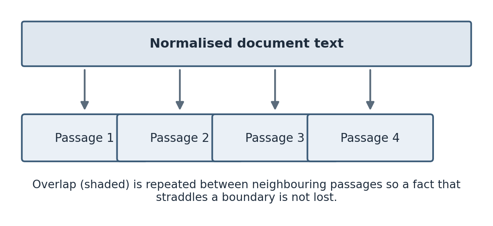
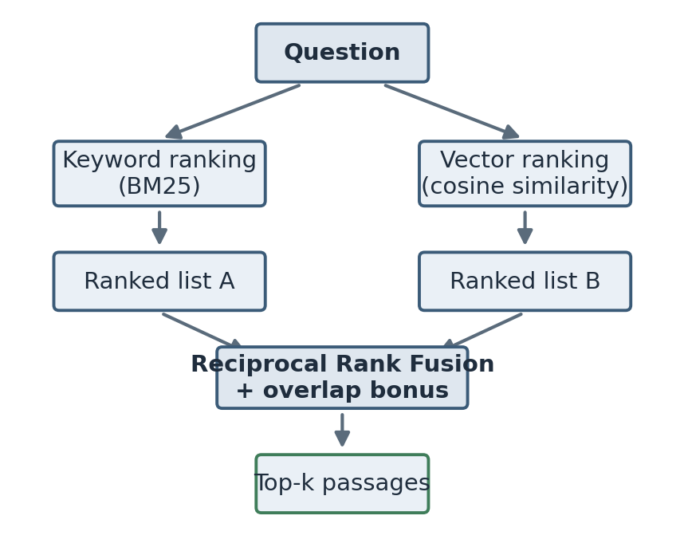
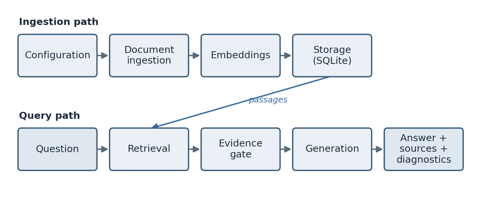
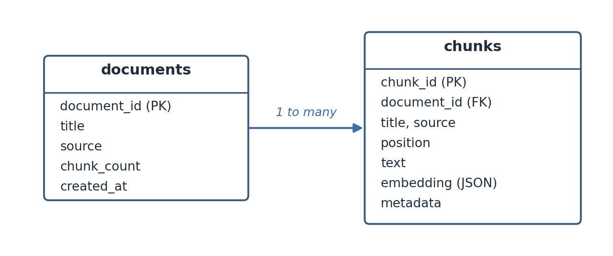
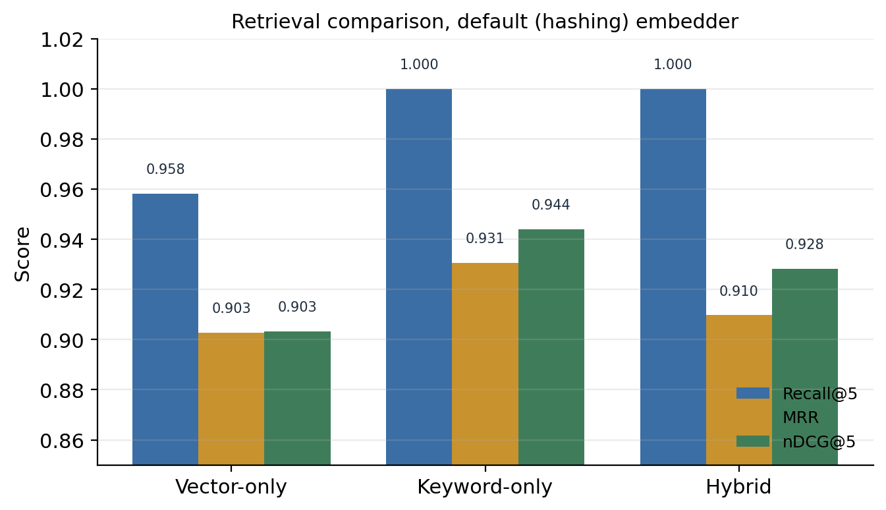
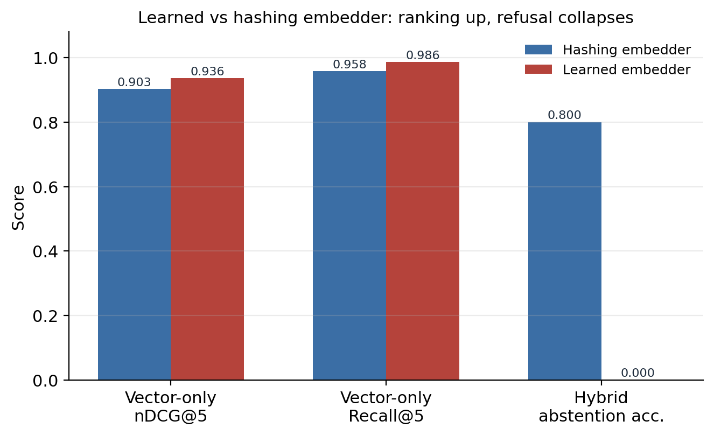
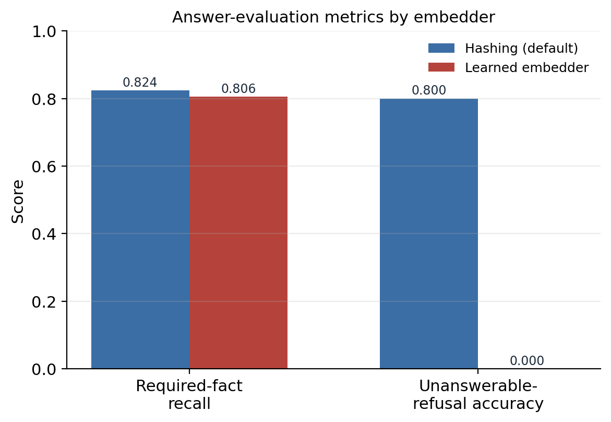
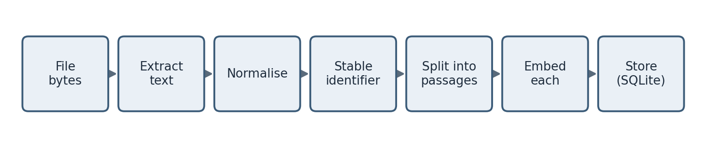
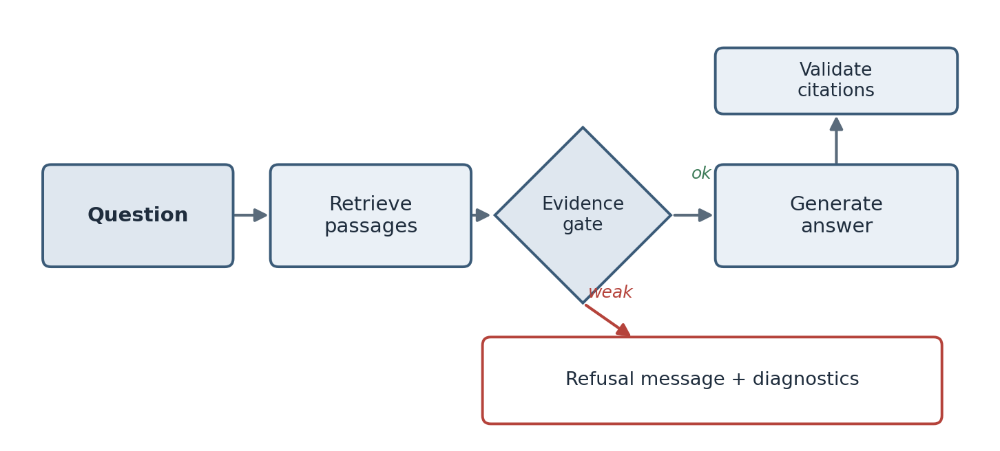

# Title page

**Building a Grounded Retrieval-Augmented Question Answering System over a Controlled Document Collection**

A report submitted in partial fulfilment of the requirements for the summer internship component of the

**Bachelor of Technology in Computer Science and Engineering**

Submitted by

**Bhoomi177**
Enrolment No.: [Enrolment Number]
Department of Computer Science and Engineering
[University Name]

Under the guidance of

Faculty supervisor: [Faculty Supervisor Name], Department of Computer Science and Engineering
Internship mentor: [Mentor Name], [Host Organisation / Research Group]

Internship duration: 19 May 2026 to 4 July 2026 (seven weeks)

Session: 2025–2026

\newpage

# Certificate

This is to certify that the internship report titled *Building a Grounded Retrieval-Augmented Question Answering System over a Controlled Document Collection* is a record of the work carried out by **Bhoomi177** (Enrolment No. [Enrolment Number]) during the seven-week summer internship held from 19 May 2026 to 4 July 2026, under my supervision.

The work presented here was done by the candidate and has not been submitted elsewhere for the award of any degree or diploma. The candidate completed the objectives agreed at the start of the internship and demonstrated the technical understanding expected at this level.

\
\

Faculty supervisor: [Faculty Supervisor Name]
Department of Computer Science and Engineering
[University Name]
Date: __________

Internship mentor: [Mentor Name]
[Host Organisation / Research Group]
Date: __________

\newpage

# Declaration

I declare that this report is my own work. The code, experiments, figures, and analysis described here were produced by me during the internship, except where I have credited a library, paper, or piece of documentation. I have cited the external sources I relied on. Where I reused an idea from a paper or an open-source project, I have said so in the text.

The evaluation numbers reported in Chapter 7 are the actual results produced by the code on the included test set. I have not rounded them in my favour or reported a run I could not reproduce. Where a result is weaker than I hoped, or where a metric flatters the system for the wrong reason, I have written that down instead of hiding it.

\
\

Bhoomi177
Enrolment No.: [Enrolment Number]
Date: __________
Place: [City]

\newpage

# Acknowledgements

I want to thank my internship mentor, [Mentor Name], for giving me a project that was small enough to finish and open-ended enough to teach me something. Most of what I learned this summer came from the weekly reviews, where I had to explain a decision and usually discovered halfway through the explanation that I did not fully understand it yet.

I am grateful to my faculty supervisor, [Faculty Supervisor Name], for the reading suggestions early on, and for pushing me to measure retrieval and generation separately rather than reporting one number and calling it accuracy.

Thanks also to the other interns in the group, who sat through my questions about BM25 and cosine similarity, and who caught at least two bugs I would have shipped otherwise. And thanks to my family, who put up with a summer of me talking about chunk overlap at dinner.

Any mistakes that remain are mine.

Bhoomi177

\newpage

# Abstract

Large language models write fluent answers, but on their own they do not know the contents of a specific document collection, and they will produce a confident answer even when nothing supports it. Retrieval-Augmented Generation (RAG) is the common response to both problems: instead of putting the documents inside the model, the system retrieves relevant passages at question time and gives them to the model as context, so the answer can be grounded in real evidence and traced back to a source.

This report describes a RAG question-answering system that I built during a seven-week summer internship. The system ingests a collection of documents, splits them into passages, retrieves the most relevant passages for a question using a combination of keyword ranking (BM25) and vector similarity fused with Reciprocal Rank Fusion, checks whether the retrieved evidence is strong enough to answer at all, and then produces an answer with inline citations back to the sources. It runs fully offline by default, with no API key, using a deterministic embedding baseline and an extractive answerer, and it can optionally call the OpenAI Responses API or a local Ollama model instead. The backend is a FastAPI service over SQLite; there is a small web interface for uploading documents, asking questions, and inspecting sources.

The point of the project was not to reach a high accuracy number on a small test set. It was to build every stage of a RAG pipeline so that it could be inspected and measured: ingestion, retrieval, the evidence gate, generation, citation handling, and evaluation are separate pieces, each with its own diagnostics. On a test set of 41 questions over 13 documents, the offline configuration reached an average required-fact recall of 0.8241 and correctly refused four of five genuinely unanswerable questions. A later experiment that swapped the deterministic embedder for a learned sentence-embedding model improved pure retrieval ranking but, on this particular corpus, did not improve the end-to-end answers, and it broke the refusal thresholds entirely because those thresholds had been tuned to the old score scale. That result taught me more than a clean improvement would have.

The report covers the background concepts, the system design, a week-by-week account of the work, the implementation, the evaluation and its honest limitations, and the things I would do differently.

\newpage

# Abbreviations

| Short form | Meaning |
| --- | --- |
| ANN | Approximate Nearest Neighbour |
| API | Application Programming Interface |
| BM25 | Best Match 25 (a keyword ranking function) |
| CORS | Cross-Origin Resource Sharing |
| DCG | Discounted Cumulative Gain |
| IDF | Inverse Document Frequency |
| JSON | JavaScript Object Notation |
| JSONL | JSON Lines |
| LLM | Large Language Model |
| MRR | Mean Reciprocal Rank |
| nDCG | Normalised Discounted Cumulative Gain |
| NLP | Natural Language Processing |
| RAG | Retrieval-Augmented Generation |
| REST | Representational State Transfer |
| RRF | Reciprocal Rank Fusion |
| SQL | Structured Query Language |
| UI | User Interface |

\newpage

# Chapter 1. Introduction

## 1.1 Context of the internship

I did this internship as the summer research component of my undergraduate degree. The brief I was given was deliberately loose: build a working assistant that can answer questions from a fixed set of documents, and be able to explain and measure every part of it. My mentor was clear from the first meeting that a demo which produces nice-looking answers was not the goal. The goal was a system where, if the answer is wrong, you can open it up and say which stage failed.

That framing shaped everything I did. It is easy to wire an LLM to a search box and get something that looks impressive in a two-minute demo. It is much harder to say why the system answered the way it did, whether the answer was actually supported by the documents, and what happens when the documents do not contain an answer at all. The second thing is what this report is about.

The application domain we chose was a set of documents about a university research internship: eligibility rules, stipend and expenses, the work schedule, ethics and data-governance policy, computing access, publication policy, and an older archived FAQ. This was convenient because the documents were short, self-contained, and the rules sometimes contradicted each other between the current policy and the archived one. That gave me realistic cases where retrieval has to pick the right source, and where the honest answer is sometimes that the documents disagree.

## 1.2 The problem

There are two separate problems that RAG addresses, and it is worth stating them plainly because the rest of the report keeps coming back to them.

The first is that a language model does not know your documents. Its knowledge is fixed at the point it was trained. It has never seen this year's internship handbook, and it certainly has not seen a private policy document. If you ask it a question about that document, it will answer from whatever it remembers about internships in general, which may be wrong for your specific case.

The second is that a language model will answer anyway. If you ask a question that the documents do not cover, a plain LLM does not usually say "I don't know." It produces something plausible. In an assistant meant for looking up rules, a confident wrong answer is worse than no answer, because a user is likely to trust it. A statement that a model invents without support in the evidence is usually called a hallucination, and reducing hallucination was one of the recurring themes of the internship.

RAG deals with the first problem by retrieving passages from the documents at question time and pasting them into the prompt, so the model is answering from the actual text rather than from memory. It deals with the second problem partly through instructions (tell the model to answer only from the supplied context) and partly through an evidence gate (check whether the retrieved passages are actually relevant before letting the model answer at all). The system I built does both.

## 1.3 Why not just fine-tune a model?

Early on I asked my mentor why we did not simply fine-tune a model on the documents, since that also injects knowledge. The answer was practical. Fine-tuning changes the model's internal weights using training examples. If a document changes, you have to build new training data and fine-tune again. You also lose the ability to point at a source, because the knowledge is now spread across millions of parameters rather than sitting in a passage you can quote. And fine-tuning does not, by itself, teach a model to refuse when it lacks evidence.

RAG keeps the model unchanged and changes the input instead. Documents can be added or removed at any time with no retraining. Every answer can show the passages it came from. Retrieval quality can be measured on its own, separately from how well the model writes. For a document assistant, that combination is usually the right trade-off. The two techniques are not mutually exclusive, and a larger system might use both, but for this project RAG alone was the sensible choice.

## 1.4 Objectives of the internship

At the start we wrote down a short list of objectives. I kept this list on a sticky note for the whole seven weeks and checked things off against it.

The first objective was to build an end-to-end pipeline that runs locally with no API key, so that the whole thing is reproducible and does not depend on a paid service being available. The second was to ingest text documents and PDFs, normalise them, split them into passages with traceable identifiers, and store them so that every passage can be traced back to its document and position. The third was to retrieve evidence using both keyword and vector signals, and to combine them sensibly rather than picking one. The fourth was to produce answers that carry citations, and to expose the retrieved passages to the user so the answer can be checked. The fifth was to refuse clearly when the evidence is too weak, instead of guessing. The sixth was to let the answer generator be swapped between an offline mode, the OpenAI API, and a local Ollama model through configuration alone. The seventh was to evaluate the system with a fixed, versioned set of test questions and report separate numbers for retrieval and for answers. The last was to do all of this with tests, diagnostics, and documentation, so the work could be picked up by someone else.

I met all of these by the end, though not in the order I expected, and objective five (refusal) turned out to be far more subtle than it looked on the sticky note.

## 1.5 Scope and non-goals

It is as useful to say what the project is not. It is not a production system. There is no login, no per-user access control, no multi-tenant separation, and no audit logging. The document index is a single SQLite file meant for one user on one machine. The offline embedding baseline is deliberately simple and is not meant to compete with a real learned embedding model. The system does not check that a citation actually supports the specific sentence it is attached to; it checks that the citation number is valid and points at a retrieved source, which is a weaker guarantee. The test corpus is synthetic and small, so the numbers in Chapter 7 are useful for guiding engineering decisions but are not evidence that the system would work on real documents at scale.

I mention these here rather than burying them at the end because a report that only lists what works is not honest, and my supervisor made a point of that in week one.

## 1.6 How this report is organised

Chapter 2 covers the background concepts, so that a reader who has not seen RAG before can follow the rest. Chapter 3 lists the tools and how the development environment was set up. Chapter 4 describes the system design and the main design decisions. Chapter 5 is the week-by-week account of the internship, which is where most of the actual story lives, including the things that went wrong. Chapter 6 goes through the implementation module by module. Chapter 7 is the evaluation: the dataset, the metrics, the results for two different embedders, and a frank discussion of what the numbers do and do not show. Chapter 8 collects the problems I hit and what I learned from them. Chapter 9 covers security, privacy, and ethics. Chapter 10 is limitations and future work. Chapter 11 is the conclusion. The appendices hold the configuration reference, the command list, a glossary, and selected code.

\newpage

# Chapter 2. Background and concepts

This chapter explains the ideas the project rests on. I have tried to write it the way I would have wanted it explained to me in week one, when I knew what an LLM was but had only a vague idea of how retrieval actually worked. A reader who already knows RAG can skip to Chapter 4.

## 2.1 Artificial intelligence, machine learning, and NLP

A quick placement of terms, because they get used loosely. Artificial intelligence is the broad field of building software that does things we associate with human reasoning: understanding language, recognising images, planning, making decisions. Machine learning is the part of AI where the system learns patterns from data instead of being given an explicit rule for every case. Natural language processing, or NLP, is the part concerned with human language: analysing it, searching it, and generating it.

This project is mostly NLP and information retrieval. The offline mode does not learn anything at run time; it applies fixed procedures for tokenising text, ranking passages, and selecting sentences. The optional providers bring in a learned model that does generate language. It is worth being clear about which parts are learned and which are deterministic, because that distinction explains a lot of the system's behaviour, and I got it wrong in my own head for the first two weeks.

## 2.2 Language models and tokens

A large language model is a neural network trained on a very large amount of text to predict the next token in a sequence. A token is the unit the model works in. It is often a word, but it can be a piece of a word or a punctuation mark; the exact scheme depends on the model's tokeniser. When you give a model a prompt, it repeatedly predicts the next token, and the sequence of predictions is the answer.

Two properties of this design matter for RAG. First, the model's knowledge comes from its training data, which is frozen. It has no way to know about a document written after training, or a private document it never saw. Second, the model predicts a likely continuation, not a true one. If the prompt gives it no relevant facts, it still produces the most likely-sounding text, and that text can be wrong while reading as confident. Bender and colleagues (2021) made the sharper version of this point when they described such models as producing fluent text without any grounding in meaning or truth. RAG is one practical way to add that grounding back.

There is also a hard limit called the context window: the maximum amount of text a model can take in and produce in one request. You cannot paste a fifty-page handbook into every prompt, both because it may not fit and because it would be wasteful and slow. Retrieval is partly a way of choosing the small slice of the documents that is worth spending the context window on.

## 2.3 Retrieval-Augmented Generation

Retrieval-Augmented Generation was introduced by Lewis and colleagues (2020) as a way to combine a retriever over a document collection with a generative model, so that the model conditions its answer on retrieved passages rather than on its parameters alone. The idea has since become the standard pattern for question answering over private or changing documents.

The loop, stated simply, is this. Ingest the documents and cut them into passages. Turn each passage into something searchable and store it. When a question arrives, turn the question into the same kind of searchable form, rank the passages by relevance, and take the top few. Decide whether those passages are actually good enough to answer from. If they are, put them in the prompt, ask the model to answer using only them and to cite them, and then check the citations before returning the answer. If they are not, refuse.

Every one of those steps is a place where the system can be made better or worse, and every one is a place where it can fail. A large part of what I learned this summer was how to tell which step was responsible when an answer came out wrong. That is only possible if each step keeps some record of what it did, which is why the system carries diagnostics through the whole pipeline.

## 2.4 Chunking

A document is usually too long and too mixed to be a good unit of retrieval. If a fifty-page handbook is one searchable item, then a question about the stipend competes with a question about ethics for the same item, and the retriever cannot tell them apart. Chunking cuts each document into smaller passages, so that the passage about the stipend can be retrieved on its own.

Choosing the chunk size is a real trade-off and not just a tuning knob. Chunks that are too small can lose the context needed to understand a fact; a sentence that says "this must be approved in advance" is useless if the chunk does not also say what "this" is. Chunks that are too large mix several topics, which dilutes the ranking signal and wastes context window. There is no universally correct size. This project uses passages of up to about 900 characters with 160 characters of overlap between neighbours, chosen after a small amount of trial and error described in Chapter 5.

Overlap deserves a note. If you cut cleanly at a boundary, a fact that straddles the boundary can be split so that neither chunk contains it whole. Repeating a little text from the end of one chunk at the start of the next reduces that risk. It costs some storage and some redundancy in retrieval, which is a price worth paying for a small corpus.

{width=88%}

**Figure 1.** Chunking with overlap. A normalised document is split into passages of up to about 900 characters, with roughly 160 characters repeated between neighbours (shaded) so a fact that spans a boundary is not lost.

## 2.5 Embeddings and vector similarity

An embedding is a list of numbers, a vector, that stands in for a piece of text. The goal of a good embedding model is that texts with similar meaning get vectors that are close together in the space, even if they share no words. This is what lets a search for "payment for interns" match a passage that only ever says "stipend." That behaviour is not magic; it is a property the embedding model has to have learned, and a poor embedding will not have it.

The standard way to measure how close two vectors are is cosine similarity, which is the cosine of the angle between them. For two vectors a and b it is the dot product of a and b divided by the product of their lengths. If the vectors are already scaled to unit length, the denominator is one and the similarity is just the dot product, which is convenient and fast. A higher cosine means the vectors point in more similar directions, which for a good embedding means the texts are more related.

There is an important subtlety that took me a while to internalise. Cosine similarity over a weak embedding is not a semantic signal at all. If the embedding is really just a re-encoding of which words appear, then "vector similarity" is measuring word overlap in disguise. This project's default embedder has exactly that property, and Chapter 3 and Chapter 7 both come back to it, because it changes what the word "hybrid" means for this system.

Learned embedding models are a different story. Reimers and Gurevych (2019) showed with Sentence-BERT that a transformer fine-tuned to produce sentence embeddings can capture paraphrase and semantic similarity far better than earlier methods, and models in that family are what I used for the later experiment. Karpukhin and colleagues (2020) showed, in their work on dense passage retrieval, that learned dense retrieval can beat strong keyword baselines on open-domain question answering, though as I found out, whether it beats them on a small, vocabulary-aligned corpus is a different question.

## 2.6 Keyword retrieval and BM25

The older and still very effective family of retrieval methods works on words rather than meaning. You break the text into terms, and you rank passages by how well their terms match the query's terms, with some care about which terms are informative.

BM25, described by Robertson and Zaragoza (2009) in their survey of probabilistic relevance models, is the standard function here. It rewards a passage for containing the query's terms, it weights rarer terms more heavily through inverse document frequency (a term that appears in every passage tells you nothing, a term that appears in one tells you a lot), and it normalises for passage length so that a long passage does not score highly just for being long and containing the term by chance. The function has two tuning constants, usually written k1 and b, and the values 1.5 and 0.75 are common defaults; I used those.

Keyword retrieval is strong exactly where embeddings can be weak: exact names, acronyms, dates, identifiers, and technical terms. It is weak where the question and the document use different words for the same thing. That complementarity is the usual argument for combining the two, which is what the next section is about.

## 2.7 Combining rankings with Reciprocal Rank Fusion

If you have a keyword ranking and a vector ranking, you need a way to combine them. The naive approach of adding the raw scores does not work well, because the two scores are on completely different scales; a BM25 score and a cosine similarity are not comparable numbers. You would end up with whichever score happens to be larger dominating the sum.

Reciprocal Rank Fusion, introduced by Cormack and colleagues (2009), sidesteps this by combining ranks instead of scores. Each method contributes an amount that depends only on the position a passage holds in that method's ranking, computed as one divided by a constant plus the rank. The constant, usually 60, softens the difference between the top ranks so that the very first result does not completely swamp the second. A passage that both methods rank near the top gets contributions from both and ends up with a high fused score. The method is simple, it needs no score calibration, and it works surprisingly well, which is why it is a common default.

The system adds a small extra term based on literal query-term overlap on top of the fused score, which nudged a few borderline cases in the right direction on this corpus. I am honest in Chapter 7 that a term like that should really be tuned on separate data rather than chosen because it helped the numbers I was looking at.

{width=62%}

**Figure 2.** Hybrid retrieval. The question is scored by keyword ranking (BM25) and by vector similarity independently; the two rankings are combined with Reciprocal Rank Fusion, and the top-k passages are returned.

## 2.8 The evidence gate and refusal

A ranker always returns something. Even for a question the documents cannot answer, it returns its best guess, and that best guess might still be a poor match. If you feed that poor match to the generator and ask for an answer, you often get a confident answer built on irrelevant evidence. This is one of the main ways a RAG system hallucinates, and it is avoidable.

An evidence gate is a check that runs after retrieval and before generation. It looks at how strong the top results are and decides whether they are worth answering from. If they are too weak, the system returns a refusal instead of an answer. The hard part is the word "weak." There is no single threshold that is right for every embedder and every corpus, and the thresholds this system uses were tuned by hand on the test corpus, which is a real limitation. The most instructive result of the whole internship, described in Chapter 7, is what happened to those thresholds when I changed the embedder underneath them.

## 2.9 Citations and grounding

Grounding means that the answer rests on retrieved evidence rather than on the model's memory. Citations are the visible part of grounding: a marker in the answer, like a bracketed number, that points back to the source passage a statement came from. Citations matter for two reasons. They let a user check the answer, and they let a developer debug it.

There is an important distinction I learned to keep. A citation being present is not the same as a citation being correct. The system can guarantee that a citation number is valid and points at a passage that was actually retrieved. It cannot, in its current form, guarantee that the passage genuinely supports the specific claim the citation is attached to. That stronger property, sometimes called claim-level groundedness or faithfulness, needs an entailment check that I did not build. I am careful about this in Chapter 7, because it is easy to report a "citation coverage" number that looks perfect and means less than it appears to.

## 2.10 Evaluating a RAG system

The last background idea is that you cannot evaluate a RAG system with a single number. Retrieval and generation can fail independently. Retrieval can find exactly the right passage while the generator writes a poor answer from it, and the generator can write a fluent answer while retrieval missed the fact entirely. If you only measure the final answer, you cannot tell these apart, and you cannot fix the right stage.

So the evaluation in this project measures retrieval and generation separately. For retrieval it uses standard ranking metrics: Recall at k (is a correct source among the top k results), Mean Reciprocal Rank (how early the first correct result appears), and normalised Discounted Cumulative Gain (a ranking metric that rewards correct results near the top and discounts lower positions). For the answers it uses a fact-coverage measure and separate measures for whether the system refused when it should have and answered when it should have. Chapter 7 defines each of these precisely and reports them. The recurring lesson is that each number measures one narrow thing, and that reading them together, with their limitations in mind, is the only way to get an honest picture.

## 2.11 A short note on transformers

I did not build a transformer, and this project treats the language model as a component with an interface rather than something to understand internally. But it helps to know roughly what is inside the box. Modern language models are built on the transformer architecture introduced by Vaswani and colleagues (2017). Its central idea is attention, a mechanism that lets the model weigh how much each token in the input should influence the representation of each other token. That is what lets a model relate a pronoun to the noun it refers to several sentences earlier, or connect a question to the relevant part of a long context.

For RAG the practical consequence is simple. The model does not search the retrieved passages in any structured way; it attends over them as ordinary text in its context, alongside the instructions and the question. This is why the order and formatting of the retrieved passages in the prompt can matter, and why clearly labelling each passage with a number helps the model cite it. The sentence-embedding models I used for the later experiment are also transformers, fine-tuned so that the vector they produce for a sentence is close to the vectors of sentences with similar meaning, which is the property Reimers and Gurevych (2019) engineered directly.

## 2.12 A worked retrieval example

Concepts are easier to hold with a concrete example, so here is one small question moving through retrieval, using round numbers for clarity rather than the exact values from a run.

Suppose the question is "how much is the intern stipend paid each month," and the corpus has three passages. Passage A is the stipend section of the current policy and contains the words stipend, paid, monthly, and an amount. Passage B is an archived FAQ that also mentions the stipend but with an older figure. Passage C is about laboratory access and shares almost no words with the question.

Tokenising the question and dropping stopwords leaves roughly the terms intern, stipend, paid, month. BM25 scores each passage on those terms. Passage A scores highest because it contains stipend, paid, and a monthly figure, and because stipend is a rare term across the corpus and so carries a high inverse-document-frequency weight. Passage B scores well too, since it also discusses the stipend. Passage C scores near zero.

The vector side embeds the question and each passage and takes the cosine similarity. With a learned embedder, passages A and B come out close to the question because they are about the same topic, and C stays far away. With the hashing embedder, the result is similar but for a shallower reason: A and B share actual words with the question, and C does not, so the "vector" similarity is really tracking the same word overlap the keyword side already saw.

Fusion then combines the two rankings. Both signals rank A first and B second, so A gets contributions from the top of both rankings and ends up first overall, with B second and C a distant third. The evidence gate looks at A's scores, sees that they are strong, and lets the answer through. The generator then quotes the monthly figure from A and cites it. The interesting case is the conflicting one: because A is the current policy and B is the archived FAQ with an older figure, the system needs to prefer A, and it does so here because A ranks above B. That is exactly the kind of case the conflicting questions in the test set were written to exercise.

This example also shows where the system can go wrong. If the question had used a word the documents do not, such as asking about "pay" when the documents only say "stipend," the keyword side would find little, and on the hashing embedder the vector side would find little either, because it is lexical. A learned embedder would still connect pay to stipend. That single difference is the entire argument for dense retrieval, and it is also why a corpus that never uses different words for the same thing, like the one in this project, does not show the difference.

\newpage

# Chapter 3. Tools and development environment

## 3.1 Language and why Python

The whole project is written in Python. That was not a difficult choice. The libraries for text processing, web serving, and machine learning that I needed all have mature Python versions, and the optional providers (OpenAI and the sentence-embedding models) ship Python clients first. The environment I worked in had Python 3.9, so I kept the code compatible with 3.9 rather than reaching for newer syntax. That constraint bit me exactly once, described in Chapter 8, when a type-hint style I wanted was not available.

## 3.2 The main libraries

The web layer is FastAPI, a Python framework for building HTTP APIs. I chose it because it validates request and response shapes from ordinary Python type hints, which removed a class of bugs where a field is missing or the wrong type, and because it serves static files, so the small web interface and the API could live in one process. The application is run with Uvicorn, the standard server for FastAPI during development.

Storage is SQLite, which is a full relational database that lives in a single file with no separate server process. For a single-user tool that needs to persist an index between runs, it is close to ideal: nothing to install, nothing to keep running, and the file can be deleted to reset the state. I discuss its limits for this use in Chapter 4, because storing vectors in a plain SQL table and scanning them all on every query is fine for a demo and wrong for scale.

For the offline pieces I only needed the Python standard library: hashlib for the hashing embedder, re for tokenising, math for the scoring functions, json for serialising vectors, sqlite3 for storage, and urllib for the Ollama call. Keeping the default install light was a deliberate goal, and it is the reason the heavier dependencies are all optional.

The optional dependencies are pypdf for reading PDF files, the openai package for the OpenAI provider, sentence-transformers for the learned-embedding experiment, and a running Ollama server for local generation. Each of these is imported only when it is actually needed, so a plain installation runs without any of them. Testing uses pytest, and there is a browser test written with Playwright that drives the web interface in a real Chromium browser.

## 3.3 Repository layout

The code is organised so that each concern has one file, which made it easy to test and change pieces in isolation. The backend package holds the settings, text processing, embeddings, storage, retrieval, the language-model adapters, the orchestration service, the API, the data models, and the evaluation and comparison scripts. The frontend folder holds the single HTML page, its stylesheet, and its script. There is a folder of sample documents, a folder of evaluation data and recorded results, a tests folder, a docs folder, and a deliverables folder that holds this report and the presentation.

The project is on GitHub at github.com/Bhoomi177/advanced-rag-llm-app, and the version history there mirrors the week-by-week progress in Chapter 5, since I committed at the end of most working sessions.

## 3.4 Configuration and secrets

Every value I might want to change without editing code is read from an environment variable, with a sensible default baked in. These include the chunk size and overlap, the number of results to retrieve, the evidence-gate thresholds, the choice of embedding provider and model, the choice of language-model provider, and the API details for the remote providers. There is an example environment file in the repository that lists them all with their defaults.

The one value that must never be committed is the OpenAI API key. It is read from an environment variable and is never written into code, into the frontend, or into any committed file. The example file has the key field blank. I checked before the first push that the real key was not anywhere in the history, because a leaked key in a public repository is the kind of mistake that is expensive and public.

## 3.5 How the project is run

There are a handful of commands that do everything. One installs the dependencies. One runs the development server and opens the interface in a browser. One runs the unit tests. One runs the answer evaluation over the test questions and writes the results to a file. One runs the retrieval comparison across the three ranking strategies. One runs the browser test against a running server. Wrapping these in short commands mattered more than it sounds, because it meant I could re-run the whole evaluation after any change without remembering a long incantation, and re-running it often is what kept me honest about whether a change actually helped.

\newpage

# Chapter 4. System design

## 4.1 Design principles

Three principles guided the design, and they came up in almost every review with my mentor.

The first was that the system should run offline by default. If the baseline needs an API key or a model download, then it cannot be reproduced by someone without those things, and every result becomes dependent on an external service being up and unchanged. So the default path uses a deterministic local embedder and an extractive answerer, and everything more powerful is optional. This turned out to be the single most useful decision, because it meant the tests and the evaluation ran the same way every time.

The second was that every stage should keep diagnostics. When an answer is wrong, I wanted to be able to see the retrieval scores, whether the evidence gate fired, which provider answered, and how long it took, without adding print statements and re-running. The answer that the API returns carries all of this alongside the text.

The third was that the pieces should be swappable. The embedder, the language-model provider, and the storage are all reached through a narrow interface, so that one can be replaced without touching the rest. The learned-embedding experiment in Chapter 7 only took an afternoon precisely because the embedder was already behind such an interface, and that afternoon paid back the effort of building the interface earlier.

## 4.2 The pipeline

The system is a pipeline of small modules, each with one responsibility. Configuration reads the environment into a settings object. Ingestion extracts text, normalises it, assigns a stable identifier, and cuts it into passages. The embedder turns each passage into a vector. Storage persists the documents, passages, vectors, and metadata. Retrieval ranks the passages for a query using the keyword and vector signals fused together. The evidence gate decides whether to answer. Generation produces the answer text through the chosen provider. Orchestration wires all of this together and handles citations and diagnostics. The API exposes it over HTTP, and the frontend gives it a face.

The value of this separation showed up constantly during debugging. When a question returned a wrong answer, I could look at each stage's output in turn and find the one that was responsible, rather than guessing at the whole thing as a black box.

{width=95%}

**Figure 3.** The system architecture. The ingestion path runs when a document is added; the query path runs when a question is asked. Storage feeds the retrieval stage with the stored passages.

## 4.3 The data model

There are two stored entities. A document has an identifier, a title, a source filename, a count of its passages, and a creation time. A passage, which the code calls a chunk, has its own identifier, the identifier of the document it belongs to, the title and source copied down for convenience, its zero-based position within the document, its text, its embedding stored as JSON, and a small metadata object. The passage identifier is built from the document identifier and the position, so it is both unique and readable.

Two design choices in this model are worth calling out. The document identifier is derived from the filename and the content by hashing them, so re-ingesting the same file produces the same identifier and replaces the old copy instead of creating a duplicate. And every passage carries enough provenance (its document, source, and position) that a citation can be built from it directly. Provenance is not a nice-to-have here; it is the thing that makes citations possible at all.

{width=85%}

**Figure 4.** The data model. Each document has many chunks; every chunk stores its text, its embedding as JSON, its metadata, and the provenance fields needed to build a citation.

## 4.4 The two main flows

There are two paths through the system. The ingestion path takes a file, extracts and normalises its text, assigns the document identifier, cuts the text into passages, embeds each passage, and writes everything to storage. The query path takes a question, loads the stored passages, ranks them, applies the evidence gate, and either refuses or asks the provider to answer, then validates the citations and returns the answer with its sources and diagnostics.

I have drawn both flows out in Chapter 6 alongside the code, because the flows and the modules line up almost one to one, which is a sign the design held together.

## 4.5 Storage: an honest note on the word "index"

Early drafts of my documentation called the storage a "vector index." My supervisor pushed back on that word, and he was right. An index, in the search sense, is a data structure that lets you find the near neighbours of a vector without comparing against everything. This system has no such structure. On every query it loads all of the passages, parses every stored vector back from JSON, and compares the query against all of them in plain Python. That is a linear scan, not an index.

For the corpus in this project, which is about 29 passages, the difference does not matter; the scan takes a few milliseconds. But calling it an index would imply a scaling property it does not have, and a reader who took that at face value would be misled. So the documentation now calls it a linear-scan vector store, and Chapter 10 lists moving to a real approximate-nearest-neighbour index as the first thing I would change for a larger corpus. I am spending a paragraph on a single word because the habit of naming things accurately, even when the accurate name is less impressive, was one of the more useful things I picked up this summer.

## 4.6 Provider abstraction

The answer generator is reached through a single small interface: given a question, the retrieved results, and the settings, return the answer text. Three implementations sit behind it. The offline one selects sentences from the retrieved passages and stitches them together with citations, using no external service. The OpenAI one calls the Responses API. The Ollama one calls a local model server. Because they share the interface, the orchestration code does not know or care which one it is talking to, and switching between them is a single configuration value.

This is a standard pattern, but building it early was one of the better calls I made, for a reason I did not anticipate. It forced the offline mode to be a first-class provider rather than a fallback, which meant the whole pipeline, including citation handling, was exercised by the default path and by the tests. If the offline mode had been an afterthought, a lot of bugs would have hidden until the first time someone ran it without a key.

\newpage

# Chapter 5. Week-by-week account

This is the longest chapter and the most honest one. I kept a working log through the internship, partly because my mentor asked for it and partly because I found I could not remember on Friday what I had been stuck on Tuesday. What follows is that log, cleaned up but not sanitised. I have left the dead ends in, because the dead ends are where I learned the most.

## 5.1 Week 1 (19–23 May): scoping and reading

The first week had almost no code in it, which frustrated me at the time. My mentor spent our first meeting talking me out of starting to build. He wanted me to be able to state, in one sentence, what problem the system solved and how I would know if it worked, before I wrote a line. I could not, at first. My one sentence was "an AI that answers questions about documents," which he pointed out described roughly every product launched that year and committed me to nothing.

By the end of the week the sentence had become something I could defend: a system that answers a question using passages retrieved from a fixed document set, shows the sources behind each answer, and says when the documents do not contain an answer. The last clause was his addition, and I did not yet understand how much work it hid.

Most of the week was reading and setup. I read the original RAG paper by Lewis and colleagues, which was harder going than I expected because it assumed a lot of retrieval background I did not have, and I read a survey of BM25 to get that background. I also read enough about embeddings to be dangerous, which is to say I understood the picture of vectors in a space and did not yet understand that not all embeddings deliver on that picture.

On the practical side I set up the repository skeleton, the virtual environment, and the folder structure. I wrote down the eight objectives from Chapter 1 on a sticky note. I chose the stack: Python, FastAPI, SQLite, and an offline-first default, after a short argument with myself about whether to start with a hosted vector database. My mentor's rule settled it: if the baseline needs a service, the baseline is not reproducible. I collected the first few sample documents about the internship domain and read them closely enough to know what questions they could and could not answer, which later became the basis of the test set.

What I took away from week one was that "know how you will measure it before you build it" is not bureaucratic advice. Every week after this one, the question "how would I know if this helped" had an answer, because I had set up the measurement first. The weeks where I ignored that lesson are visible below.

## 5.2 Week 2 (26–30 May): ingestion and storage

Week two was the first building week, and it was about getting documents into the system in a form retrieval could use. This is the unglamorous part of RAG that turns out to matter enormously, because everything downstream depends on the quality of the passages.

I started with text extraction. Plain text formats are decoded as UTF-8, with invalid bytes replaced rather than crashing the whole ingest, which matters because a single bad byte in one file should not stop a batch. PDF support came through the pypdf library, kept optional so that the default install stays light. After extraction I normalise the text: strip null characters, unify line endings, collapse runs of spaces, and reduce long gaps of blank lines to a single paragraph break. None of this is clever, but skipping it produces passages full of ragged whitespace that then pollute the token counts in retrieval.

Then came chunking, which took most of the week and taught me the most. My first version cut the text every 900 characters, full stop. It was simple and it was bad: it cut sentences in half and split facts across a boundary so that neither side was answerable. My second version split on paragraphs and packed whole paragraphs together up to the size limit, carrying a little overlap from the end of one chunk into the start of the next. That was much better, but it broke on one document that had a single paragraph longer than the whole chunk size, which my packing logic had not considered; it produced one enormous chunk. I added a branch that splits an over-long paragraph on word boundaries, still with overlap. That is the version in the code today.

The bug with the over-long paragraph is a good example of a thing I now expect. The happy path worked on twelve of the thirteen documents, and I nearly moved on. The thirteenth was the one that taught me the packing logic had an unstated assumption. My mentor's comment in the Friday review was that the interesting inputs are always the ones you did not think of, and that a test set should include them on purpose. I added a chunking test with a deliberately over-long paragraph.

Storage was the calmer half of the week. I set up the SQLite schema with a documents table and a chunks table, wrote the code to insert a document and its chunks in one transaction, and made re-ingesting a file replace its old chunks rather than duplicate them, using the content-derived identifier from Chapter 4. I stored each embedding as a JSON array of numbers in a text column. At the time this seemed obviously fine. It is fine for this corpus. It is also the root of the scaling limitation I discuss later, because it means every query re-parses every vector from text, and I want to be clear that I did not appreciate that cost in week two. It only became visible when I measured latency in week seven with a heavier embedder.

## 5.3 Week 3 (2–6 June): retrieval

Week three was retrieval, and it contained the single most useful mistake of the internship: I spent two days not realising that my "semantic" search was not semantic at all.

I needed embeddings, and I wanted the default to be offline and deterministic, so I wrote a hashing embedder. It tokenises the text, and for each token it uses a hash to pick a position in a fixed-length vector and a sign, and it accumulates a weight based on the token's count, then scales the vector to unit length. This runs anywhere, needs no model, and gives the same vector every time. I was pleased with it.

I then wrote the keyword side: a tokeniser that lowercases words and drops a small list of stopwords, and a BM25 scorer with the standard constants. And I wrote the fusion: rank the passages by the vector score, rank them by the keyword score, and combine the two ranks with Reciprocal Rank Fusion, plus a small bonus for literal term overlap. I sorted by the fused score and took the top five. On the sample questions it worked well, and I wrote in my log that hybrid retrieval was clearly better than either signal alone.

Then my mentor asked a question in the review that I could not answer. He asked what my vector search was actually matching on, given that the embedder was a hash of the tokens. I said it matched on meaning. He asked how a hash of the word "stipend" could be close to a hash of the word "payment," since they are different tokens and hash to different places. It cannot. My "vector" similarity was, in effect, another measure of shared words, dressed up as something more. The two signals I was so pleased to be fusing were largely the same signal.

That was a bad afternoon and a good lesson. It did not make the system wrong; a lexical vector signal is still a signal, and the hashing embedder is genuinely useful as a zero-dependency default. But it meant the word "hybrid" was overstating what the system did, and it meant that any comparison of vector-only against keyword-only on this embedder would be comparing two flavours of the same thing. I wrote that down honestly rather than quietly deleting my earlier optimistic log entry. The proper fix, a learned embedder, had to wait until the pipeline was finished, and it is the story of week seven.

The rest of week three was making retrieval debuggable. Each result carries its fused score, its vector score, its keyword score, its term overlap, and its rank. This felt like over-engineering at the time. It was not. In weeks five and six, almost every time a question returned the wrong passage, I found the cause by reading those five numbers, and I would not have found it by staring at the final answer.

## 5.4 Week 4 (9–13 June): generation, providers, and the evidence gate

Week four turned retrieved passages into answers. It had three parts: building the answer generators, wiring up the providers, and the evidence gate, which was much harder than the other two combined.

The generators were straightforward to start. The offline one, which is the default, takes each retrieved passage, picks the sentence with the most overlap with the question, collects up to three such sentences, and tags each with the number of its source so the answer carries citations. It does not write new prose; it selects and stitches. That is a real limitation on answer quality, but it is deterministic and free and it never invents anything, which for a default is a fair trade. The OpenAI adapter calls the Responses API, passing the system instructions separately from the retrieved context and asking the model to answer only from that context and to cite it. The Ollama adapter does the same against a local model server. All three sit behind the one interface from Chapter 4, so orchestration does not know which is answering.

The prompt is worth a sentence. Each retrieved passage becomes a numbered block with its title, source, and text, and the instructions tell the model to answer only from these blocks, to cite them with bracketed numbers, to say the answer is unavailable if the blocks do not support one, and to be concise. This does not make hallucination impossible, and I am careful not to claim it does. It makes the evidence explicit and gives the model a clear instruction to stay inside it.

Then the evidence gate, which ate the rest of the week. The idea is simple: before answering, check whether the top result is actually strong enough, and refuse if not. The difficulty is defining "strong enough." My first version refused whenever the top fused score was below a threshold. It refused too much, because a perfectly good answer can have a modest fused score if the question is short. My second version looked at several signals together and only refused when all of them were weak: a low fused score and a low vector score and low term overlap and a low keyword score. That worked far better, because a genuine answer almost always scores well on at least one of them.

But the thresholds in that rule are four hand-chosen numbers, and I chose them by running the unanswerable questions in my test set and adjusting until the system refused them without refusing the answerable ones. This is tuning on the test set, and I knew even as I did it that it was a form of cheating that would come back to bite me. It did, in week seven, in a way I did not predict. For week four, though, the gate worked on the corpus, refused four of the five unanswerable questions, and let all the answerable ones through, and I recorded that with a note to myself that the thresholds were not real constants and would not survive a change of embedder. That note turned out to be the most accurate thing I wrote all summer.

There was one more piece I want to flag, because I got it wrong first and it matters. When an answer came back from a provider without any citation, my first orchestration code quietly appended a citation to the first source, so that every answer had at least one citation marker. This made my "citation coverage" metric a perfect 1.0. It also made that metric meaningless, because the coverage was manufactured by the code rather than earned by the model. I did not catch this in week four. It was caught in the code review in week six, and removing it is described there. I mention it here so the timeline is honest: the mistake was made in week four and lived in the code for two weeks before anyone noticed.

## 5.5 Week 5 (16–20 June): the API, the interface, and the test set

By week five the core worked from a Python prompt, but there was no way to use it and no way to measure it properly. Week five built both.

The API came first. I exposed the operations the interface would need: a health check, listing documents, clearing the index, uploading a file, ingesting the sample documents from a path, asking a question, and running the evaluation. FastAPI made the request and response shapes explicit, and errors like an empty question or an unsupported file type turn into clean HTTP status codes rather than stack traces. The question endpoint returns the answer, the citations, the full list of retrieved sources, and the diagnostics, so a caller can show a clean answer while a developer can still see everything behind it.

The frontend is deliberately plain: one HTML page with a stylesheet and a script, no framework. It lets you upload a document or load the samples, ask a question, read the answer with its citation markers highlighted, see the sources with their scores and excerpts, watch the latency and health, and run the evaluation. I spent a little time making sure every value from the server is escaped before it is put into the page, so that document text cannot inject markup, which is a basic safety property that is easy to forget until it bites you.

The more important half of week five was the test set, because without it every claim about the system was an anecdote. I wrote 41 questions over the 13 documents, and I labelled each one with the answer, the source documents that should be retrieved, the specific facts an answer should contain, and a category. I deliberately did not make them all easy lookups. Thirty are ordinary answerable questions. Three are ambiguous, where the question could be read more than one way. Three are conflicting, where the current policy and the archived FAQ disagree and the system has to prefer the right source. Five are genuinely unanswerable, where the documents simply do not contain the answer, and the correct behaviour is to refuse. Building the unanswerable and conflicting cases on purpose was the best decision in this week, because those are exactly the cases a system that only ever gets shown easy questions will fail on in real use.

I stored the questions as JSON Lines, one JSON object per line, because that format is easy to version in git, easy to review in a pull request, and easy to extend one line at a time. Then I wrote the evaluation runner. For each question it asks the system, checks how many of the required facts appear in the answer, records whether a citation was present or the system refused, and records whether the refusal decision was correct. It reports the average fact coverage, the citation-or-refusal rate, the accuracy on the unanswerable cases, and the average latency.

The first real evaluation run was a genuinely good moment. The offline system reached an average required-fact recall of 0.8241 and refused four of the five unanswerable questions. I was pleased, and then I made myself write down all the reasons the numbers were softer than they looked, because my supervisor had asked me to treat every good number with suspicion. The fact-coverage measure is a lenient word-overlap check, not a test of meaning. The citation coverage was, as noted, partly manufactured by the code. The latency of a few milliseconds is a small-corpus offline figure and says nothing about a real deployment. I put those caveats next to the numbers rather than under them.

I also wrote the browser test this week, which drives the interface in a real Chromium browser: it loads the page, clears the index, uploads a document, loads the samples, asks a question, checks that citations and sources appear, runs the evaluation, and checks for console errors and layout overflow on a narrow screen. It is not a test of answer quality, but it catches the class of bug where the backend is fine and the interface is broken, which unit tests miss entirely.

## 5.6 Week 6 (23–27 June): comparison, and a code review that found real problems

Week six had two halves. The first was a proper retrieval comparison. The second was a code review that found more wrong with my code than I expected, and working through those fixes is the part of this report I am most glad to be able to write.

The comparison first. I wrote a script that evaluates three retrieval strategies on the same test set: vector only, keyword only, and the hybrid fusion. It measures each with Recall at 5, Mean Reciprocal Rank, and normalised Discounted Cumulative Gain, judged at the level of which source documents are retrieved, since that is what my labels record. It also folds in how well each strategy abstains on the unanswerable cases, and it writes all of this to a results file with the settings that produced it, so the run is reproducible.

The result was more interesting than a clean win. Keyword-only actually had the best pure ranking on this corpus, with the highest nDCG. Hybrid came out ahead only on the combined score, and only because the combined score includes the abstention accuracy, where the evidence gate helped. In other words, on this vocabulary-aligned corpus, the hybrid was not winning on retrieval quality; it was winning because of the refusal policy attached to it. And since the vector signal was lexical anyway, as I had found in week three, this was not really a fair test of dense retrieval at all. I wrote all of that in the results discussion rather than reporting "hybrid wins" and moving on, because "hybrid wins" would have been technically true from one number and misleading about why.

The second half of the week was a code review. My mentor asked another engineer to read the whole codebase as if preparing to maintain it, and to be blunt. The review was blunt, and it was useful. It found several real problems, and I want to list them plainly, because fixing them was a large part of what I actually learned about writing production-adjacent code.

The first and worst was the fabricated citation from week four. The reviewer pointed out that appending a citation when the model produced none does not improve grounding, it just fakes the metric. I removed it. Now the citations reflect only what the model actually cited, and when an answer has none, the system records that as a diagnostic flag instead of hiding it. This lowered my citation-coverage number in the honest cases, which is the correct outcome; the number is now real.

The second was that the browser cross-origin policy was set to allow any origin while also allowing credentials, which is both insecure and, as it happens, invalid: browsers reject that combination. I changed it to an explicit list of allowed origins read from configuration, defaulting to localhost.

The third was a piece of dead code in the settings module: an unreachable branch left over from a copy-paste. Small, but the reviewer's point was that dead code makes a reader wonder what they are missing, and it should just be deleted. I deleted it.

The fourth was that the default OpenAI model name in the configuration was a made-up string that did not correspond to any real model. It had crept in as a placeholder and never been fixed. A reader who did not recognise it would reasonably assume either a mistake or a bluff. I changed it to a real model identifier.

The fifth was that the file upload had no size limit, so a large upload would be read entirely into memory. I added a limit, configurable, that rejects oversized uploads with a clear error before reading them.

The sixth was that the destructive endpoints, which clear the index, had no protection at all. For a local single-user tool that is a defensible choice, but the reviewer's point was that it should be a stated choice, not an accident, so I documented it plainly in the limitations rather than pretending it was secure.

None of these were fun to receive. All of them were fair. The lesson I took from the review is that the first version of code that passes its own tests is not finished; it is the version that passes the tests you thought to write, and a second reader will find the assumptions you could not see. I would now ask for a review much earlier.

## 5.7 Week 7 (30 June–4 July): the learned-embedding experiment, and finishing

The last week had the experiment I had been waiting to run since week three, and the writing-up. The experiment was the more educational of the two, because it did not go the way I expected, and the way it failed taught me something a success would not have.

Since week three I had known the hashing embedder was really a lexical signal, and that a fair test of "hybrid" retrieval needed a real learned embedder. By week seven the embedder was behind a clean interface, so swapping it was quick. I added an adapter for a sentence-transformer model, kept it optional behind a guarded import so the default install stays light, and made the choice of embedder a single configuration value. I picked a small, well-known sentence-embedding model of the same vector size as the hashing baseline, so nothing else in the pipeline had to change. Then I re-ran the retrieval comparison and the answer evaluation with the learned embedder and compared them against the baseline.

The retrieval ranking improved, which was the expected and satisfying part. Pure vector retrieval got clearly better: its nDCG rose and its recall went up, confirming that under the hashing embedder the vector and keyword channels really had been near-duplicates, and that a learned model makes the vector channel a genuinely different and stronger ranker. So far, so good, and it validated the whole point of building the embedder behind an interface.

Then two things happened that I did not expect. First, the improvement in ranking did not reach the answers. The end-to-end fact-coverage score actually went slightly down, not up. When I looked into it, the reason made sense: this test corpus was hand-written, so the questions share vocabulary with the documents, which is exactly the situation where keyword matching is already near its ceiling and a semantic model has little room to add value. Dense retrieval pays off most when the question and the document use different words, and my corpus did not have much of that. A better-designed corpus, with more paraphrase, would probably show the learned embedder helping end to end. Mine did not, and I reported that rather than quietly keeping the baseline numbers.

The second surprise was the important one. The evidence gate collapsed completely with the learned embedder. Its accuracy on the unanswerable questions dropped to zero, across every retrieval mode. The reason was exactly the one I had flagged in week four. The gate's four thresholds had been tuned to the score scale of the hashing embedder. A learned model produces cosine similarities on a different scale, generally higher even for unrelated passages, so the thresholds that used to catch weak evidence never fired, and the system stopped refusing anything. The refusal thresholds were not portable constants; they were fitted to one embedder, and changing the embedder invalidated them.

I could have hidden this by re-tuning the thresholds for the new embedder and reporting only the tuned result. I did not, because the uncalibrated failure is the actual finding: an evidence gate has to be recalibrated whenever the retrieval scoring underneath it changes, and a threshold tuned on one setup tells you nothing about another. That is a genuinely useful thing to know, and it is the kind of thing that only shows up if you change one component and watch what breaks. My conclusion, which is in the report and the documentation, is to keep the deterministic embedder as the reproducible default and to treat the learned embedder as an option that requires the gate to be recalibrated, plus a real dependency and roughly six times the query latency, before its retrieval gains are worth taking end to end.

The rest of the week was finishing. I wrote the project documentation, including a long technical guide and this report. I made the presentation. I cleaned up the repository, checked once more that no secret was in the history, and pushed it to GitHub as a public repository under my account. I updated the documentation to match the code after the week-six fixes, because a surprising number of the docs still described the old fabricated-citation behaviour and the made-up model name, and stale documentation is its own kind of bug.

On the last day I re-read my week-one sticky note. All eight objectives were done. The one that had looked easiest in week one, refusing when the evidence is weak, had turned out to be the deepest, and the experiment that failed had taught me more than the ones that worked. That felt like the right note to end on.

\newpage

# Chapter 6. Implementation

This chapter walks through the code module by module. It repeats a little of the design from Chapter 4, but here the focus is on how each part actually works, with the real algorithms and a few short excerpts. The modules line up with the pipeline: configuration, ingestion, embeddings, storage, retrieval, generation, orchestration, the API, and the frontend.

## 6.1 Configuration

Configuration is a single frozen data class populated from environment variables, with defaults for every field. Frozen means it cannot be changed after it is built, so a request cannot accidentally mutate the settings halfway through. The fields include the chunk size and overlap, the embedding dimension, the number of results to retrieve, the two evidence-gate thresholds, the embedding provider and model, the allowed cross-origin list, the upload size limit, the language-model provider, and the connection details for the OpenAI and Ollama providers.

Two small helpers read integer and float values from the environment and fall back to the default if the value is missing or malformed, so a typo in an environment variable degrades to the default rather than crashing the service. A full table of the variables and their defaults is in Appendix A.

## 6.2 Ingestion and chunking

Ingestion is spread across the text-processing module and the orchestration service. Text extraction decodes plain-text formats as UTF-8 with replacement, and extracts PDF text through pypdf when that optional library is present. Normalisation then cleans up whitespace and control characters.

The document identifier is a short hash of the filename and the normalised text, so the same file always produces the same identifier. Each passage identifier is the document identifier followed by the passage position, which keeps it unique and human-readable.

The chunker packs paragraphs up to the size limit and carries overlap between neighbours. The core of it, lightly trimmed, looks like this:

```python
paragraphs = _split_paragraphs(normalized)
pieces = []
current = ""
for paragraph in paragraphs:
    if len(paragraph) > chunk_size:
        if current:
            pieces.append(current.strip()); current = ""
        pieces.extend(_split_long_text(paragraph, chunk_size, chunk_overlap))
        continue
    candidate = f"{current}\n\n{paragraph}".strip() if current else paragraph
    if len(candidate) <= chunk_size:
        current = candidate
    else:
        pieces.append(current.strip())
        overlap = _tail_overlap(current, chunk_overlap)
        current = f"{overlap}\n\n{paragraph}".strip() if overlap else paragraph
if current:
    pieces.append(current.strip())
```

The branch at the top is the fix from week two: a paragraph longer than the whole chunk size is split on word boundaries instead of becoming one oversized chunk. The rest packs paragraphs and carries a tail overlap when it starts a new piece.

## 6.3 Embeddings

The embeddings module holds the tokeniser, the default hashing embedder, the optional learned embedder, and a factory that chooses between them.

The hashing embedder builds a fixed-length vector. For each token it takes a hash, uses part of the hash to choose a position and part to choose a sign, adds a weight based on the token count, and finally scales the vector to unit length. It is deterministic and needs nothing external. The important honest caveat, repeated from Chapter 5, is that this is a lexical representation dressed as a vector; it preserves which words appear, not what they mean.

The learned embedder wraps a sentence-transformer model behind the same two methods, embed and embed many, and loads the model lazily on first use. Its import is guarded, so the default install does not require the heavy dependency. The factory picks the implementation from the configured provider:

```python
def make_embedder(settings):
    if settings.embedding_provider in ("sentence-transformers", "st", "sbert"):
        return SentenceTransformerEmbedder(settings.embedding_model)
    return HashingEmbedder(dim=settings.embedding_dim)
```

Because the orchestration service calls this factory rather than naming a class, swapping the embedder is a configuration change, which is what made the week-seven experiment quick.

Similarity is cosine similarity, which for unit-length vectors is a dot product. The retrieval code clamps negative vector scores to zero so that a negative dot product does not act as a relevance signal.

## 6.4 Storage

Storage is a small class over SQLite with two tables. The documents table holds the document metadata; the chunks table holds each passage with its text, its embedding as a JSON array in a text column, and its metadata. Inserting a document deletes any previous chunks for that identifier and writes the new ones in a single transaction, which keeps the store consistent if two ingests race.

Retrieval reads all chunks with one query and reconstructs each passage, parsing the embedding back from JSON. This is the linear-scan design from Chapter 4. For the demonstration corpus it is a few milliseconds; for a large corpus it would be the first thing to replace with a real vector index. I have not hidden this behind the word "index" anywhere in the code or the docs.

## 6.5 Retrieval

The retriever computes both signals and fuses their ranks. It embeds the query, computes the clamped cosine similarity against every passage, computes a BM25 score for every passage, ranks the passages by each signal, and combines the ranks with Reciprocal Rank Fusion plus a small overlap bonus. The BM25 scorer is the standard function:

```python
idf = math.log(1 + ((total_docs - df + 0.5) / (df + 0.5)))
numerator = counts[term] * (k1 + 1)
denominator = counts[term] + k1 * (1 - b + b * (doc_len / avgdl))
score += idf * (numerator / denominator)
```

with the usual constants k1 = 1.5 and b = 0.75. The fusion is one over sixty plus the rank, summed across the two signals, with a term-overlap bonus added on top. Each result keeps all of its component scores and its rank, which is the diagnostic information that made debugging retrieval tractable.

## 6.6 The evidence gate

The gate is a single method on the orchestration service. It refuses when there are no results, or when the top result is weak on all four signals at once: a low fused score, a low vector score, low term overlap, and a low keyword score. The thresholds are configuration values with defaults that were tuned on the test corpus. As Chapter 7 shows, those defaults are tied to the hashing embedder's score scale and do not transfer to a different embedder, which is the project's central caution about evidence gating.

## 6.7 Generation and citations

The three providers share one interface. The offline provider selects the best-matching sentence from each retrieved passage, takes up to three, and tags each with its source number. The OpenAI provider calls the Responses API with the instructions and context separated and a bounded output length, and it only sends a reasoning setting for models that support it. The Ollama provider posts to a local model server at a low temperature.

Two small pure functions keep citations honest. One strips any citation number that falls outside the range of retrieved results, so a model cannot cite a source that does not exist. The other returns the list of valid citation numbers that actually appear. The orchestration service builds citation objects only for those numbers. If an answer has results but the model cited none, the service records an "uncited" flag in the diagnostics. This is the corrected behaviour from week six; the earlier code fabricated a citation here, which is exactly what a citation-handling module should not do.

## 6.8 Orchestration

The orchestration service ties the pipeline together. On ingestion it extracts, identifies, chunks, embeds, and stores. On a question it validates the input, loads the passages, retrieves, applies the gate, and either refuses or generates, then validates citations and assembles the response. The response carries the answer, the citations, the full source list, and the diagnostics, which include the provider, the passage counts, the top-k setting, whether the system refused, whether the answer was uncited, and the latency. Carrying the diagnostics all the way out to the caller is what makes the system inspectable rather than a black box.

## 6.9 The API and frontend

The API is a small FastAPI application. It serves the frontend page, reports health, lists and clears documents, accepts uploads (now with a size limit), ingests a path, answers questions, and runs the evaluation. The cross-origin policy is built from the configured allow-list. Errors become clean status codes.

The frontend is one page of plain HTML, CSS, and JavaScript. It provides the controls for uploading, asking, and evaluating, and it renders the answer with its citations and the sources with their scores and excerpts. Every value from the server is escaped before it is inserted into the page, so document content cannot inject markup.

## 6.10 Tests

The test suite covers the parts most likely to break silently: chunking, ingestion through to an answer, the evaluation logic, the retrieval comparison, the low-evidence refusal, and the OpenAI adapter with a mocked client so no real call is made. There are nine tests, and they run in under a second, which mattered because I ran them after almost every change. The browser test is separate and drives the real interface. Tests do not prove the answers are good; they prove the plumbing holds, which is a different and necessary thing.

\newpage

# Chapter 7. Evaluation and results

This chapter reports what the system actually does on the test set. I want to be careful here, because it is the chapter most tempting to oversell, and my supervisor's standing instruction was to treat every good number as guilty until proven innocent. So each result comes with what it does and does not show.

## 7.1 Why the evaluation is split

A RAG system has two stages that fail independently, so a single number cannot describe it. Retrieval can find the right passage and the generator can still write a poor answer; the generator can write a fluent answer while retrieval missed the fact. Measuring only the final answer hides which stage is at fault. The evaluation therefore reports retrieval metrics and answer metrics separately, and I read them together.

## 7.2 The test set

The test set has 41 questions over 13 documents, stored as JSON Lines. Thirty are answerable, three are ambiguous, three are conflicting (the current policy and the archived FAQ disagree), and five are genuinely unanswerable. Each question carries its expected source documents, the facts an answer should contain, and a category. The unanswerable and conflicting cases were written on purpose, because they are the cases that separate a careful system from one that always answers.

I should state the obvious limitation plainly: this is a small, synthetic, hand-written corpus. It is good for guiding engineering decisions and for catching regressions. It is not a held-out real-world benchmark, and no number here should be read as evidence that the system would perform the same on real documents at scale. A proper research claim would need separate tuning and test splits that are not reused, and human-reviewed relevance labels.

## 7.3 The metrics, defined

Required-fact recall is the fraction of a question's expected facts that appear in the answer. The check is lenient: a fact counts as present when at least half of its words longer than three characters appear in the answer. This is easy to compute and cheap to run, and it is blind to meaning, negation, and whether the matched words belong to the same claim. It is a proxy, and I treat it as one.

Citation-or-refusal coverage is one when a response either carries a citation or refuses. It is a structural check, not a test of whether a cited source supports the claim.

Unanswerable-refusal accuracy is the fraction of the genuinely unanswerable questions that the system correctly refused. Answerable non-refusal rate is the fraction of answerable questions the system did not wrongly refuse. Read together, these show the trade-off between refusing too little (unsafe answers) and refusing too much (unhelpful).

For retrieval, Recall at 5 asks whether an expected source is among the top five retrieved sources. Mean Reciprocal Rank rewards the first correct source appearing early. Normalised Discounted Cumulative Gain at 5 rewards correct sources near the top and normalises against the ideal ordering. The comparison judges at the level of source documents, because that is what the labels record. The combined benchmark score is a project-defined blend of ranking and abstention, useful for picking a baseline on this corpus and not meant as a universal standard.

## 7.4 Results with the default embedder

The offline configuration with the hashing embedder is the system's default, and these are its recorded numbers on the answer evaluation.

| Metric | Value |
| --- | ---: |
| Questions | 41 |
| Fact-scored questions | 36 |
| Average required-fact recall | 0.8241 |
| Citation-or-refusal coverage | 1.0000 |
| Answerable non-refusal rate | 1.0000 |
| Unanswerable-refusal accuracy | 0.8000 |
| Average latency | about 4.6 ms |

The retrieval comparison across the three strategies, on the same corpus, is below.

| Strategy | Recall@5 | MRR | nDCG@5 | Abstention | Combined |
| --- | ---: | ---: | ---: | ---: | ---: |
| Vector only | 0.9583 | 0.9028 | 0.9033 | 0.6000 | 0.8663 |
| Keyword only | 1.0000 | 0.9306 | 0.9441 | 0.0000 | 0.8290 |
| Hybrid | 1.0000 | 0.9097 | 0.9283 | 0.8000 | 0.9126 |

{width=80%}

**Figure 7.** Retrieval comparison on the default (hashing) embedder. Keyword-only has the highest nDCG@5; the three strategies are close because the hashing vector signal is itself largely lexical.

The number that first looks like the headline, hybrid's combined score of 0.9126, needs the honest reading I gave in Chapter 5. Keyword only has the best pure ranking here; its nDCG of 0.9441 is the highest in the table. Hybrid leads the combined score only because that score folds in abstention accuracy, where the evidence gate refused four of five unsupported questions. Since the vector signal on this embedder is lexical, the two fused signals are correlated, so this is not a clean demonstration that dense retrieval helps. It is a demonstration that a refusal policy attached to a lexical ranker does well on a lexical corpus. That is a narrower and more accurate claim.

The perfect citation-or-refusal coverage of 1.0000 also deserves its caveat. The offline answerer tags every sentence it emits with a source number, so in offline mode a citation is almost always present by construction. The metric confirms the plumbing, not the faithfulness of the citation to the claim.

## 7.5 Results with a learned embedder

In week seven I swapped the hashing embedder for a learned sentence-embedding model of the same vector size, changed nothing else, and re-ran both the comparison and the answer evaluation. The retrieval comparison with the learned embedder is below.

| Strategy | Recall@5 | MRR | nDCG@5 | Abstention | Combined |
| --- | ---: | ---: | ---: | ---: | ---: |
| Vector only | 0.9861 | 0.9398 | 0.9365 | 0.0000 | 0.8223 |
| Keyword only | 1.0000 | 0.9306 | 0.9441 | 0.0000 | 0.8290 |
| Hybrid | 1.0000 | 0.9236 | 0.9408 | 0.0000 | 0.8260 |

On the answers, the learned embedder gave a required-fact recall of 0.8056, an unanswerable-refusal accuracy of 0.0000, and a latency of about 29 ms.

Three findings come out of this, and each taught me something.

The first is that learned dense retrieval genuinely ranks better. Vector-only nDCG rose from 0.9033 to 0.9365 and recall from 0.9583 to 0.9861. This confirms what I suspected in week three: under the hashing embedder the vector and keyword channels were near-duplicates, and a learned model makes the vector channel a distinct and stronger ranker.

The second is that the ranking gain did not reach the answers. Required-fact recall slipped slightly, from 0.8241 to 0.8056, and keyword only still had the highest nDCG. The reason is the corpus. The questions were hand-written and share vocabulary with the documents, so keyword matching is already near its ceiling and a semantic model has little room to help. Dense retrieval earns its keep on paraphrase and vocabulary mismatch, which this corpus does not contain much of. On a corpus with more of that, I would expect the learned embedder to help end to end. On mine it did not, and I report the slightly lower number rather than the one I would have preferred.

The third finding is the one I keep coming back to. The evidence gate collapsed. Its accuracy on the unanswerable questions fell to zero for every retrieval mode. The gate's thresholds had been tuned to the hashing embedder's score scale, and the learned model produces cosine similarities on a different, generally higher scale, so the thresholds that used to catch weak evidence never fired. The gate is not broken in principle; it is uncalibrated for the new embedder. The lesson is that refusal thresholds are specific to the scoring underneath them and must be recalibrated whenever that scoring changes. A threshold tuned on one embedder tells you nothing about another, and the zero in that table is uncalibrated gating rather than a retrieval failure.

{width=80%}

**Figure 8.** Swapping in a learned embedder. The ranking metrics improve, but the hybrid abstention accuracy falls from 0.80 to 0.00 because the gate thresholds were tuned to the hashing embedder's score scale.

{width=72%}

**Figure 9.** Answer-evaluation metrics by embedder. The learned embedder gives a slightly lower fact recall on this vocabulary-aligned corpus, and its uncalibrated gate refuses none of the unanswerable questions.

## 7.6 What the numbers add up to

Putting it together: on this corpus, the deterministic default is a reasonable baseline, the hybrid's apparent win is mostly its refusal policy rather than dense retrieval, and a learned embedder improves ranking but, here, neither improves the answers nor works with the existing gate. The practical recommendation, which is in the documentation, is to keep the deterministic embedder as the reproducible default, and to treat the learned embedder as an opt-in that requires the gate to be recalibrated and pays a real cost in latency and dependencies before its ranking gains are worth taking.

More broadly, the value of the evaluation was not any single number. It was that each stage could be measured on its own, so that when the learned embedder made ranking better and answers slightly worse and refusal completely broken, I could see all three at once and understand why, instead of watching one aggregate score move and guessing. That is the property I set out to build in week one, and it is the one I am most satisfied with.

\newpage

# Chapter 8. Problems I hit, and what they taught me

Rather than a generic list of difficulties, this chapter collects the specific problems that cost me real time, because those are the ones with lessons attached. Several were mentioned in passing in Chapter 5; here I say what actually went wrong and what I changed in how I work.

## 8.1 The vector search that was not semantic

The two days in week three when I thought I had semantic search and did not were the most useful failure of the internship. I had built a hashing embedder, seen it return sensible results on the sample questions, and concluded it was matching on meaning. It was matching on shared words. The problem was not the hashing embedder, which is a perfectly good default for what it is. The problem was that I had believed a component did something without ever testing the specific claim. Cosine similarity over a lexical embedding is still cosine similarity, and it produces plausible results, which is exactly what makes the mistaken belief so easy to hold onto. Now, when I catch myself saying a component does X, I try to think of a test that would fail if it only did some cheaper thing that looks like X from the outside.

## 8.2 The fabricated citation

The citation my code appended when the model produced none is the mistake I am least proud of and learned the most operationally from. It was not malicious; I added it so the interface would always have a citation to show, and I did not think through what it did to the metric. The result was a citation-coverage number of a perfect 1.0 that measured my own code rather than the model's behaviour. It survived my own tests because my tests checked that a citation was present, which it always was, precisely because I was forcing it. It took a second reader to see that the test and the bug had been shaped to fit each other. A metric you can make perfect by editing your own output is not measuring the system; it is measuring how willing you are to edit the output. I have been suspicious of any number that comes out perfect ever since.

## 8.3 Thresholds tuned on the test set

I knew, while I was doing it in week four, that tuning the evidence-gate thresholds on the same questions I evaluated on was a form of leakage. I did it anyway because I had no separate tuning set and the deadline was real, and I wrote a note that the thresholds were not real constants. Week seven proved the note right in the most direct way possible: change the embedder and the thresholds become worthless. The proper fix, which I did not have time to do, is a separate validation split used only for tuning. Tuning on your test set does not announce itself as a failure at the time it happens. It announces itself later, when something you did not expect to matter changes and the fitted values fall over, which is exactly how it played out.

## 8.4 The Python version constraint

A smaller, more ordinary problem. The environment had Python 3.9, and at one point I wrote a type hint using a syntax that only exists in newer versions, and the import failed with an error that did not obviously point at the cause. It took me longer than it should have to connect the error to the version, because I assumed the problem was in my logic rather than in the syntax. A mundane thing to relearn: when an error makes no sense, check the boring possibilities first, and the version of the language you are running is one of the boring possibilities.

## 8.5 Stale documentation

By the end I had documentation that confidently described behaviour the code no longer had: the fabricated citation, the made-up model name, the claim that the embedder was not yet configurable when by then it was. Documentation drifts out of sync with code silently, and a reader trusts the documentation anyway. Fixing this in week seven took real time. Since then I have tried to treat the description of a behaviour as part of the same change as the behaviour itself, rather than a thing to catch up on later.

## 8.6 The general shape of these lessons

Looking at these together, most of them are versions of the same thing: I believed something about the system that I had not actually verified, and the belief was comfortable because the system's behaviour was consistent with it right up until it was not. Semantic search that was lexical, a citation metric that was self-fulfilling, thresholds that were fitted to one setup, documentation that described an older version. The habit I am trying to build out of this internship is to ask, of each claim I make about the system, what test would catch me if I were wrong, and then to run it.

\newpage

# Chapter 9. Security, privacy, and ethics

The system is a local, single-user tool, and I built it as one. This chapter is plain about what that means, because the failure mode of a project like this is to describe it as if it were ready for a setting it was never designed for.

## 9.1 What the system does not protect against

There is no authentication, no per-user access control, and no separation between users. The document index is one SQLite file. The endpoints that clear the index have no protection, which is a reasonable choice for a tool that runs on one person's machine and a completely unreasonable one for anything exposed to a network. After the week-six review I stated this plainly in the limitations rather than leaving it implied. The path-ingestion endpoint, which reads a file from a path the caller gives, would be dangerous on an exposed service and should be restricted to an allow-listed folder before any such use.

The cross-origin policy is now an explicit list of allowed origins rather than a wildcard, and uploads are size-limited, but these are hardening measures on a tool that is still meant for local use, not a claim that it is safe to deploy.

## 9.2 Sending documents to an external service

The moment the OpenAI provider is enabled, documents and questions leave the machine and go to a third party. That is a decision with real consequences, and it is not mine to make for a user. Before turning it on, someone has to decide whether the data is allowed to leave: its classification, the provider's retention terms, where it is processed, and whether the people whose data it is have consented. The offline default exists partly so that this decision is opt-in rather than the path of least resistance. The API key lives only in an environment variable and never in the code, the frontend, a prompt, or a committed file.

## 9.3 Prompt injection

Prompt injection is the risk that untrusted text inside a document tries to hijack the model. A document could contain a line telling the model to ignore its instructions and reveal something, and because RAG pastes document text straight into the prompt, that line arrives in the model's context. The system separates the instructions from the retrieved context, which helps a little, but it does not detect or neutralise malicious content, and I did not build defences against this. For a corpus of trusted internal documents the risk is low; for a corpus that includes anything a stranger could write, it is real, and content filtering and injection test cases would be needed.

## 9.4 The ethics of a confident assistant

The deeper ethical issue is subtler than security. An assistant that answers fluently and shows sources looks authoritative, and users tend to trust things that look authoritative. Citations and refusals help, because they let a user check and they admit ignorance when ignorance is the honest state. But they do not remove bias in the documents, they do not catch a citation that points at a passage which does not actually support the claim, and they do not stop a user from taking the answer as settled. The right framing for a tool like this is decision support, not an authority. A serious deployment would need a way for users to flag wrong answers, a way to correct or remove documents, and human review for anything consequential. Building the transparency features was the easy part; using them responsibly is a human problem the software cannot solve on its own.

\newpage

# Chapter 10. Limitations and future work

## 10.1 Limitations

The honest limitations of the system, collected in one place. The corpus is small, synthetic, and hand-written, so the numbers guide engineering decisions but do not predict real-world performance. The default embedder is lexical rather than semantic. Every query scans all passages in memory, which does not scale. Citations are checked for validity but not for whether they support the claim. The fact-recall metric is a word-overlap proxy that cannot judge meaning. The evidence-gate thresholds are tuned to one embedder and do not transfer. There is no reranking, no query rewriting, no conversation memory, no OCR for scanned documents, and no structured extraction of tables. Production concerns like authentication, access control, and audit logging are absent by design. The remote providers have not been measured for real cost, latency, or failure behaviour, because the recorded runs were all offline.

## 10.2 What I would do next

If I continued this project, the order of work would be roughly this.

First, a proper data split. I would build separate tuning and test sets with human-reviewed relevance labels, so that thresholds and fusion weights could be tuned without leaking into the reported numbers. This is the single change that would make the evaluation trustworthy rather than indicative.

Second, recalibrate the evidence gate for the learned embedder and re-run the ablation. The zero abstention accuracy in Chapter 7 is uncalibrated gating, not a real result about retrieval, and it should be redone properly, with the thresholds fitted to the learned model's score scale on the tuning set.

Third, replace the linear scan with a real approximate-nearest-neighbour index, so the system could hold a corpus larger than a few dozen passages without scanning everything on every query. This is a well-trodden path with mature libraries; Johnson and colleagues (2019) describe the standard approach for similarity search at scale.

Fourth, add a reranking stage. A cross-encoder that re-scores the top candidates from the first-stage retriever usually improves ranking noticeably, at a compute cost that is acceptable because it only runs on a handful of candidates.

Fifth, claim-level grounding. Instead of checking only that a citation number is valid, check whether the cited passage actually entails the sentence it is attached to. This is the difference between the citation-coverage number I reported and a real faithfulness measure, and it is the most valuable single improvement to answer quality.

Sixth, measure the remote providers properly, with recorded model versions, token counts, cost, latency percentiles, and error handling, so that the offline and remote paths can be compared on more than answer quality.

I list these in this order because it is the order of what would most improve trust in the results, not the order of what would be most fun to build. The reranker and the learned retrieval are the interesting engineering; the data split and the honest recalibration are what would actually make the numbers mean something.

\newpage

# Chapter 11. Conclusion

I set out to build a question-answering system over a fixed set of documents where every stage could be inspected and measured, and where the system would refuse rather than guess when the evidence was weak. By the end of seven weeks all eight of the objectives from week one were met. The system ingests documents, retrieves with a fused keyword and vector ranking, gates on evidence, generates answers with citations through a choice of offline, OpenAI, or Ollama providers, and evaluates itself with a fixed test set that reports retrieval and answer quality separately.

The result I value most is not a metric. It is that when I ran the learned-embedding experiment in the last week and it made ranking better, answers slightly worse, and refusal completely broken, I could see all three effects separately and explain each one. That is only possible because the pipeline was built to be measured stage by stage, which was the point of the whole exercise.

The things I got wrong taught me more than the things I got right. I believed my vector search was semantic when it was lexical. I let my code fabricate a citation and then measured the fabrication. I tuned thresholds on my test set and watched them fall over when I changed a component. Each of these was a case of holding a comfortable belief about the system that I had not actually tested, and the recurring lesson, the one I will take into the next thing I build, is to ask what test would catch me if I were wrong, and then to run it before I claim the thing works.

The system is a prototype, and Chapter 10 is honest about how far it is from a real deployment. But it does the thing it was meant to do, its results are real and reproducible, and I can explain every part of it, including the parts that do not work. For a first serious project, being able to say that feels like the right outcome.

\newpage

# References

The following are the papers and resources I actually used and cite in the text.

1. Lewis, P., Perez, E., Piktus, A., Petroni, F., Karpukhin, V., Goyal, N., Küttler, H., Lewis, M., Yih, W., Rocktäschel, T., Riedel, S., and Kiela, D. (2020). Retrieval-Augmented Generation for Knowledge-Intensive NLP Tasks. Advances in Neural Information Processing Systems 33. Preprint arXiv:2005.11401.

2. Robertson, S., and Zaragoza, H. (2009). The Probabilistic Relevance Framework: BM25 and Beyond. Foundations and Trends in Information Retrieval, 3(4), 333–389.

3. Cormack, G. V., Clarke, C. L. A., and Büttcher, S. (2009). Reciprocal Rank Fusion Outperforms Condorcet and Individual Rank Learning Methods. Proceedings of the 32nd International ACM SIGIR Conference on Research and Development in Information Retrieval.

4. Reimers, N., and Gurevych, I. (2019). Sentence-BERT: Sentence Embeddings using Siamese BERT-Networks. Proceedings of the 2019 Conference on Empirical Methods in Natural Language Processing (EMNLP). Preprint arXiv:1908.10084.

5. Karpukhin, V., Oğuz, B., Min, S., Lewis, P., Wu, L., Edunov, S., Chen, D., and Yih, W. (2020). Dense Passage Retrieval for Open-Domain Question Answering. Proceedings of EMNLP 2020. Preprint arXiv:2004.04906.

6. Johnson, J., Douze, M., and Jégou, H. (2019). Billion-scale Similarity Search with GPUs. IEEE Transactions on Big Data, 7(3), 535–547. Preprint arXiv:1702.08734.

7. Bender, E. M., Gebru, T., McMillan-Major, A., and Shmitchell, S. (2021). On the Dangers of Stochastic Parrots: Can Language Models Be Too Big? Proceedings of the 2021 ACM Conference on Fairness, Accountability, and Transparency (FAccT).

8. Vaswani, A., Shazeer, N., Parmar, N., Uszkoreit, J., Jones, L., Gomez, A. N., Kaiser, Ł., and Polosukhin, I. (2017). Attention Is All You Need. Advances in Neural Information Processing Systems 30.

Software and documentation I relied on: the FastAPI documentation, the SQLite documentation, the sentence-transformers library by Reimers and Gurevych, the pypdf library, the OpenAI Python SDK and Responses API documentation, and the Ollama project documentation. This report was written in Markdown and rendered with Pandoc.

\newpage

# Appendix A. Configuration reference

Every value below is read from an environment variable at startup, with the default shown. A blank in an example file means the value must be supplied by the operator.

| Variable | Default | Meaning |
| --- | --- | --- |
| RAG_DATA_DIR | .rag_data | Folder holding the SQLite index file |
| CHUNK_SIZE | 900 | Target maximum characters per passage |
| CHUNK_OVERLAP | 160 | Characters repeated between neighbouring passages |
| EMBEDDING_DIM | 384 | Dimension of the hashing embedding |
| TOP_K | 5 | Number of passages retrieved per question |
| MIN_HYBRID_SCORE | 0.10 | Fused-score threshold used by the evidence gate |
| MAX_REFUSAL_KEYWORD_SCORE | 6.0 | Keyword-score condition used by the evidence gate |
| EMBEDDING_PROVIDER | hashing | hashing (default) or sentence-transformers |
| EMBEDDING_MODEL | all-MiniLM-L6-v2 | Learned model, used when the provider is not hashing |
| CORS_ALLOW_ORIGINS | localhost origins | Comma-separated list of browser origins allowed to call the API |
| MAX_UPLOAD_MB | 10 | Rejection threshold for uploaded file size |
| LLM_PROVIDER | offline | offline, openai, or ollama |
| OPENAI_API_KEY | (blank) | Secret for the OpenAI provider; never committed |
| OPENAI_MODEL | gpt-4o-mini | OpenAI model identifier |
| OPENAI_MAX_OUTPUT_TOKENS | 700 | Output length cap for the OpenAI provider |
| OLLAMA_BASE_URL | localhost:11434 | Local Ollama server address |
| OLLAMA_MODEL | llama3.1:8b | Model served through Ollama |

# Appendix B. Command reference

| Command | What it does |
| --- | --- |
| install dependencies | Installs the development requirements into the virtual environment |
| run the server | Starts the FastAPI application and serves the interface locally |
| run the tests | Runs the nine unit tests |
| run the evaluation | Scores the answers on the 41-question set and writes the results file |
| run the comparison | Compares vector-only, keyword-only, and hybrid retrieval and writes the results file |
| run the browser test | Drives the interface in a real browser against a running server |

To reproduce the learned-embedding results in Chapter 7, install the sentence-transformers package, run the comparison and the evaluation with the embedding provider set to sentence-transformers, and compare the output against the default runs.

# Appendix C. Weekly logbook summary

| Week | Dates (2026) | Focus | Main output |
| --- | --- | --- | --- |
| 1 | 19–23 May | Scoping and reading | Objectives, stack choice, repository skeleton, first documents |
| 2 | 26–30 May | Ingestion and storage | Extraction, normalisation, chunking, stable identifiers, SQLite store |
| 3 | 2–6 June | Retrieval | Hashing embedder, BM25, RRF fusion, retrieval diagnostics |
| 4 | 9–13 June | Generation and gating | Providers, prompt, offline answerer, evidence gate, first refusal logic |
| 5 | 16–20 June | API, interface, test set | FastAPI endpoints, web interface, 41-question dataset, first evaluation |
| 6 | 23–27 June | Comparison and review | Retrieval comparison, code review, fixes to real defects |
| 7 | 30 June–4 July | Learned embeddings, finishing | Pluggable embedder, ablation, documentation, report, presentation |

# Appendix D. Glossary

Approximate nearest neighbour: a way to find close vectors quickly at scale by trading a little exactness for speed. Not used in this project.

BM25: a keyword ranking function combining term frequency, inverse document frequency, and length normalisation.

Chunk: a bounded passage cut from a document for retrieval and citation.

Cosine similarity: a measure of the angle between two vectors; for unit vectors it is their dot product.

Embedding: a vector representing a piece of text for similarity search.

Evidence gate: a check after retrieval that refuses when the top results are too weak.

Grounding: making the answer rest on retrieved evidence rather than the model's memory.

Hallucination: a generated statement not supported by the evidence.

Hybrid retrieval: combining vector and keyword signals.

Inverse document frequency: a weight that raises the importance of rarer terms.

JSON Lines: a file with one JSON object per line, used for the test set.

Large language model: a neural network trained to predict and generate text.

Mean reciprocal rank: the average of one over the rank of the first correct result.

nDCG: a ranking metric rewarding correct results near the top, normalised to the ideal order.

Provenance: the traceable origin of a passage, which makes citation possible.

Reciprocal rank fusion: combining rankings by summing one over a constant plus each rank.

Refusal: declining to answer when the evidence is insufficient.

Retrieval: finding and ranking passages relevant to a question.

SQLite: a serverless database stored in a single file.

Token: a unit of text used by a tokeniser or model.

Top-k: the number of top-ranked passages kept, here five.

\newpage

# Appendix E. Requirements and use cases

I wrote a short requirements list at the start and refined it through the internship. It is not a formal specification, but it captured what the system had to do and what it had to be, and it is worth recording.

## E.1 Functional requirements

| ID | Requirement |
| --- | --- |
| F1 | Ingest text documents and PDFs, and split each into retrievable passages with traceable identifiers |
| F2 | Persist documents, passages, vectors, and metadata between runs |
| F3 | Retrieve the most relevant passages for a question using keyword and vector signals |
| F4 | Refuse to answer when the retrieved evidence is too weak |
| F5 | Generate an answer with inline citations to the retrieved sources |
| F6 | Return the retrieved sources and per-request diagnostics alongside the answer |
| F7 | Allow the answer generator to be switched between offline, OpenAI, and Ollama by configuration |
| F8 | Evaluate the system on a fixed question set and report retrieval and answer metrics separately |
| F9 | Provide a web interface for uploading documents, asking questions, and inspecting sources |

## E.2 Non-functional requirements

| ID | Requirement |
| --- | --- |
| N1 | Run fully offline by default, with no API key and no model download |
| N2 | Produce identical results across runs in the default configuration |
| N3 | Keep the default installation light, with heavy dependencies optional |
| N4 | Answer a question over the demonstration corpus in well under a second in offline mode |
| N5 | Keep secrets out of the code, the frontend, and version control |
| N6 | Keep each pipeline stage independently testable and independently measurable |

## E.3 Selected use cases

Use case: ask an answerable question. The user types a question the documents cover. The system retrieves the relevant passages, passes the evidence gate, generates an answer with citations, and shows the sources with their scores. The user reads the answer and checks a citation against its excerpt.

Use case: ask an unanswerable question. The user asks something the documents do not cover. The system retrieves passages but the evidence gate finds them too weak, so it returns the message that the answer is not available from the indexed documents, and still shows the passages it considered so the user can see it was not a failure to search.

Use case: ask a conflicting question. The current policy and the archived FAQ disagree. The system retrieves both but ranks the current policy above the archived one, so the answer reflects the current figure and cites it. This is the case the conflicting test questions were written for.

Use case: add a document. The user uploads a file. The system extracts and normalises the text, assigns a content-derived identifier, splits it into passages, embeds them, and stores them, then reports how many passages were created. Re-uploading the same file replaces its passages rather than duplicating them.

Use case: run the evaluation. The user triggers the evaluation. The system runs every test question through the pipeline, scores fact coverage and refusal behaviour, and returns the summary metrics. This is how a change is checked for regressions.

Use case: switch to a stronger generator. An operator sets the provider to OpenAI or Ollama and supplies the necessary configuration. The orchestration is unchanged; only the answer text now comes from the chosen model. The operator is responsible for the data-handling decision this implies.

\newpage

# Appendix F. The test set

The evaluation rests on 41 questions over 13 documents, so the design of that set matters as much as the code. This appendix records how it was built and gives representative questions from each category. The full set is versioned in the repository as JSON Lines.

## F.1 Categories

The 41 questions break down into 30 answerable, 3 ambiguous, 3 conflicting, and 5 unanswerable. Each question carries an identifier, the question text, the expected source documents, the specific facts an answer should contain, a category, and a difficulty label. The categories were chosen so that the set exercises not just lookup but judgement: knowing when the documents disagree, when a question is unclear, and when there is simply no answer.

## F.2 Answerable questions

These are ordinary lookups where a single passage or a small number of passages contain the answer. Examples in the spirit of the set: what evidence is required for a travel reimbursement claim; what the working hours are during the internship; what the policy is on publishing internship work as open source; what the process is for requesting laboratory access. Each of these has a clear source document and a small set of required facts, and a correct answer should quote or paraphrase those facts and cite the source.

## F.3 Ambiguous questions

These can be read in more than one way, and the point is to see whether the system retrieves sensibly despite the ambiguity rather than latching onto one reading. An example in spirit: a question about "leave" that could mean sick leave, casual leave, or leaving the programme early. A good outcome here is retrieving the passages for the most likely readings and answering from them with citations, so the user can see which sense was used.

## F.4 Conflicting questions

These are the ones where the current policy and the archived 2025 FAQ give different answers, usually because a figure or a rule changed. The system must prefer the current source. An example in spirit: a stipend figure that was revised between the archived FAQ and the current policy. The correct behaviour is to retrieve both, rank the current policy higher, and answer with the current figure, ideally without being derailed by the older one.

## F.5 Unanswerable questions

These have no answer in the documents at all, and the correct behaviour is refusal. Examples in spirit: a question about a benefit the programme does not offer, or about a policy area the documents never cover. The measure here is whether the evidence gate correctly declines. On the default embedder the system refused four of these five; the one it did not refuse retrieved a passage that shared enough vocabulary with the question to slip past the gate, which is exactly the kind of borderline case that makes a single threshold hard to set.

## F.6 Why the hard cases matter

A system shown only answerable questions will look excellent and fail the first time a real user asks something out of scope. The unanswerable and conflicting questions are a small fraction of the set by count but a large fraction of its value, because they are where the difference between a careful system and a confident one shows up. Building them deliberately, rather than hoping they turned up by accident, was one of the better decisions in week five.

\newpage

# Appendix G. Selected code listings

These are the pieces of the implementation most worth reading, taken from the repository. They are lightly trimmed for length but otherwise as they run.

## G.1 The hashing embedder

```python
class HashingEmbedder:
    def __init__(self, dim: int = 384) -> None:
        self.dim = dim

    def embed(self, text: str) -> List[float]:
        counts = Counter(tokenize(text, keep_stopwords=False))
        vector = [0.0] * self.dim
        for token, count in counts.items():
            digest = hashlib.blake2b(token.encode("utf-8"), digest_size=8).digest()
            value = int.from_bytes(digest, "big")
            index = value % self.dim
            sign = -1.0 if (value >> 8) & 1 else 1.0
            vector[index] += sign * (1.0 + math.log(count))
        return normalize(vector)
```

## G.2 Hybrid retrieval and fusion

```python
vector_ranks = self._rank_map(vector_scores)
keyword_ranks = self._rank_map(keyword_scores)
results = []
for chunk in chunks:
    vector_rank = vector_ranks.get(chunk.chunk_id, len(chunks) + 1)
    keyword_rank = keyword_ranks.get(chunk.chunk_id, len(chunks) + 1)
    rrf = (1.0 / (60 + vector_rank)) + (1.0 / (60 + keyword_rank))
    overlap = self._lexical_overlap(query_terms, set(tokenize(chunk.text)))
    score = rrf + (0.15 * overlap)
    results.append(RetrievalResult(chunk=chunk, score=score, ...))
results.sort(key=lambda result: result.score, reverse=True)
```

## G.3 The evidence gate

```python
def _should_refuse(self, results) -> bool:
    if not results:
        return True
    best = results[0]
    return (
        best.score < self.settings.min_hybrid_score
        and best.vector_score < 0.20
        and best.lexical_overlap <= 0.50
        and best.keyword_score <= self.settings.max_refusal_keyword_score
    )
```

The four conditions joined by "and" are the reason a genuine answer is rarely refused: it almost always scores well on at least one of them. They are also the four numbers that did not survive a change of embedder, as Chapter 7 describes.

## G.4 The answer path with honest citations

```python
raw_answer = self.llm.generate(normalized_question, results, self.settings)
answer = strip_invalid_citations(raw_answer, len(results))
cited = cited_numbers(answer, len(results))
uncited = bool(results) and not cited
citations = [results[number - 1].citation(number) for number in cited]
return {
    "answer": answer,
    "citations": citations,
    "sources": [r.citation(i) for i, r in enumerate(results, start=1)],
    "diagnostics": self._diagnostics(started, len(chunks), len(results),
                                     refused=False, uncited=uncited),
}
```

This is the corrected version from week six. There is no line that appends a citation when the model produced none; an uncited answer is recorded as a diagnostic instead.

## G.5 The fact-coverage check

```python
def _contains_fact(answer: str, fact: str) -> bool:
    terms = [term for term in fact.split() if len(term) > 3]
    if not terms:
        return fact in answer
    return sum(1 for term in terms if term in answer) / len(terms) >= 0.5
```

This is the lenient proxy from Chapter 7. It is honest about being a proxy: it counts a fact as present when at least half of its longer words appear in the answer, which is cheap and blind to meaning.

\newpage

# Appendix H. Figures

The two main flows through the system are shown below. The overall architecture appears earlier as Figure 3.

{width=98%}

**Figure 5.** The document ingestion flow. The stable identifier makes re-ingesting the same file idempotent, replacing the old passages rather than duplicating them.

{width=95%}

**Figure 6.** The question answering flow. The evidence gate is the branch between refusing and answering, and it is the part that had to be recalibrated when the embedder changed.

# Appendix I. Repository and artifacts

The code, the documentation, the evaluation data, and the recorded results are in the public repository at github.com/Bhoomi177/advanced-rag-llm-app. The recorded runs referenced in Chapter 7 are stored as JSON in the evaluation folder: the default results, the retrieval comparison, and the two learned-embedding runs. The commit history follows the weekly progress in Chapter 5. This report and the accompanying presentation are in the deliverables folder.

\newpage

# Appendix J. Daily logbook

This is the day-level log I kept, condensed. I have left it plain and specific rather than tidying it into a narrative, because a logbook is more useful as a record of what actually happened on each day than as a story. The weekly chapter draws on these entries.

## Week 1 (19–23 May)

Monday: First meeting with my mentor. Spent it being talked out of writing code before I could state the problem in one sentence. Left with reading to do rather than a task.

Tuesday: Read the RAG paper by Lewis and colleagues. Understood the shape, struggled with the retrieval background. Made a list of terms I did not know and started working through them.

Wednesday: Read a BM25 survey and enough about embeddings to follow the rest. Set up the repository, the virtual environment, and the folder structure. Wrote the eight objectives on a sticky note.

Thursday: Collected the sample documents and read them closely. Started listing the questions each document could and could not answer, which became the seed of the test set. Chose the stack after arguing myself out of a hosted vector database.

Friday: Review with my mentor. Defended the one-sentence problem statement, including the clause about refusing when there is no answer. Did not yet understand how much that clause hid.

## Week 2 (26–30 May)

Monday: Wrote text extraction for plain formats, decoding as UTF-8 with replacement so one bad byte does not stop a batch. Added optional PDF extraction.

Tuesday: Wrote normalisation for whitespace and control characters. First naive chunker that cut every 900 characters. It cut sentences in half; I could see immediately it was wrong.

Wednesday: Second chunker that packs paragraphs and carries overlap. Much better on twelve of thirteen documents. The thirteenth had a single paragraph longer than the chunk size and produced one giant chunk.

Thursday: Added the branch that splits an over-long paragraph on word boundaries. Wrote a chunking test with a deliberately over-long paragraph so the case is covered on purpose.

Friday: Set up the SQLite schema and the insert logic, with content-derived identifiers so re-ingesting replaces rather than duplicates. Stored embeddings as JSON. Review: the interesting inputs are the ones you did not think of.

## Week 3 (2–6 June)

Monday: Wrote the hashing embedder. Deterministic, offline, no model. Pleased with it. Wrote the tokeniser and stopword list.

Tuesday: Implemented BM25 with the standard constants, and the RRF fusion with the overlap bonus. Sorted by fused score, took the top five. Wrote in my log that hybrid was clearly better.

Wednesday: Review. My mentor asked what the vector search was matching on, given the embedder is a hash of tokens. Could not answer. Realised the vector signal was lexical, not semantic. A bad afternoon.

Thursday: Wrote the honest version of my earlier log entry rather than deleting it. Decided the proper fix, a learned embedder, would wait until the pipeline was finished. Kept the hashing embedder as a legitimate default.

Friday: Made every retrieval result carry its component scores and rank. Felt like over-engineering. It was not; it paid off in weeks five and six.

## Week 4 (9–13 June)

Monday: Built the offline extractive answerer. It selects the best sentence per passage, takes up to three, and tags each with its source number.

Tuesday: Wrote the OpenAI Responses adapter and the Ollama adapter behind the shared interface. Mocked the OpenAI client in a test so no real call is made.

Wednesday: First evidence gate, a single threshold on the fused score. Refused too much. Rewrote it to require all four signals to be weak before refusing.

Thursday: Tuned the four thresholds by running the unanswerable questions and adjusting until they were refused without refusing the answerable ones. Knew this was tuning on the test set and wrote a note that the thresholds were not real constants.

Friday: Added the citation fallback that appended a citation when the model produced none. Thought it improved the interface. It made the coverage metric meaningless, and I did not notice for two weeks.

## Week 5 (16–20 June)

Monday: Built the API endpoints: health, list, clear, upload, ingest, ask, evaluate. FastAPI made the request and response shapes explicit.

Tuesday: Built the frontend page. Made sure every server value is escaped before it goes into the page.

Wednesday: Wrote the 41 test questions and labelled each with sources, facts, and a category. Deliberately included ambiguous, conflicting, and unanswerable cases.

Thursday: Wrote the evaluation runner and ran it for the first time. Fact recall 0.8241, refused four of five unanswerable. Pleased, then wrote down every reason the numbers were softer than they looked.

Friday: Wrote the browser test that drives the interface in a real Chromium browser and checks for console errors and layout overflow.

## Week 6 (23–27 June)

Monday: Wrote the retrieval comparison script for vector-only, keyword-only, and hybrid, with Recall, MRR, and nDCG.

Tuesday: Ran it. Keyword-only had the best pure ranking; hybrid led only on the combined score because of abstention. Wrote that honestly instead of reporting "hybrid wins."

Wednesday: Code review from another engineer. It found the fabricated citation, the wildcard cross-origin policy with credentials, dead code, a made-up model name, no upload limit, and unprotected destructive endpoints.

Thursday: Fixed the review findings. Removed the fabricated citation and replaced it with a diagnostic flag. Set an explicit origin list. Added the upload limit. Deleted the dead code. Corrected the model name.

Friday: Documented the unprotected endpoints as a stated limitation rather than pretending they were secure. Review: ask for a code review much earlier next time.

## Week 7 (30 June–4 July)

Monday: Added the sentence-transformer embedder behind the existing interface, guarded so the default install stays light. Made the embedder a single configuration value.

Tuesday: Re-ran the comparison and evaluation with the learned embedder. Ranking improved. Fact recall slipped slightly. Refusal accuracy dropped to zero.

Wednesday: Worked out why refusal collapsed: the thresholds were tuned to the old score scale. Reported the uncalibrated result rather than quietly re-tuning and hiding it.

Thursday: Wrote the documentation and started this report. Found and fixed stale documentation that still described the old behaviour.

Friday: Finished the report and the presentation. Cleaned the repository, checked once more for secrets, and pushed it public. Re-read the week-one sticky note; all eight objectives done.

\newpage

# Appendix K. Worked metric calculations

The retrieval metrics in Chapter 7 are standard, but they are easier to trust if you can compute them by hand on a small example. Suppose for one question the correct source is document D, and the system's ranked list of unique sources is E, D, F, so the correct source is in second place.

Reciprocal rank for this question is one over the rank of the first correct source, which is one over two, or 0.5. Averaged over all questions, this gives the Mean Reciprocal Rank.

Recall at 5 for this question is one, because the correct source D appears within the top five. Recall at 5 only asks presence within the cut-off, not position.

Normalised Discounted Cumulative Gain at 5 rewards position. The Discounted Cumulative Gain sums, for each position, the relevance at that position divided by the logarithm of one plus the position. Here the only relevant source is at position two, contributing one divided by the logarithm base two of three, which is about 0.63. The ideal ordering would put the relevant source first, contributing one divided by the logarithm base two of two, which is one. The normalised score is the ratio, about 0.63. If the system had ranked D first, the score would be one; ranking it second costs it about a third.

Doing this by hand once made the comparison table in Chapter 7 much less abstract. It also made clear why a system can have perfect Recall at 5 and a mediocre nDCG at the same time: getting the right source into the top five is easier than getting it to the top, and the two metrics measure those two different things.
